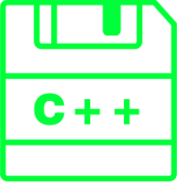

| Java | Python3 | Go | C++ | 数据库| 算法 | 计算机网络  | 操作系统 | 前端 |智力题  |
|:------:|:------:|:------:|:------:|:------:|:---------:|:------:|:------:|:------:|:------:|
|  |    |  |  |  |  |  |  |  |  |

***
**单击图片跳转到对应主题，Ctrl + Home 回到顶端，Ctrl + End 回到底端**

### Java
* [基础语法](notes/JAVA/JAVA-基础语法.md)
* [高级编程](notes/JAVA/JAVA-高级编程.md)
* [面向对象](notes/JAVA/JAVA-面向对象.md)
* [设计模式](notes/JAVA/JAVA-设计模式.md)
* [J2EE](notes/JAVA/JAVA-J2EE.md)
* [面试题合集](notes/JAVA/JAVA-面试题合集.md)
***

### Python3
* [基础语法](notes/Python/Python-基础语法.md)
* [常用数据类型 列表、字典、集合](notes/Python/Python-列表-字典-集合.md)
* [常用函数](notes/Python/Python-常用函数.md)
* [面试基础知识](notes/Python/Python-面试问题.md)
***

### Go
* [基础语法](notes/Go/基础语法.md)
* [错误集锦](notes/Go/错误集锦.md)
****

### C++
* [基础语法](notes/CPP/CPP-基础语法.md)
* [面向对象](notes/CPP/CPP-面向对象.md)
* [STL](notes/CPP/CPP-STL.md)
****

### 数据库
* [MySQL-基本概念](notes/数据库/数据库-MySQL-基本概念.md)
* [MySQL-练习题](notes/数据库/数据库-MySQL-练习题.md)
****

### 算法
参考Leetcode、剑指offer，本节不单独将数据结构作为一章，会显得内容枯燥，不易理解，可直接参照各个栈、队列、堆、树等章节的算法，结合例题和概念，更易理解和掌握。

* [Python3 版本](notes/Python/Python-算法目录.md)
* JAVA 版本
* CPP 版本
* Go 版本
****

### 计算机网络+操作系统
* [计算机网络基础练习题](/notes/计算机网络/计算机网络目录.md)
* [操作系统](notes/操作系统.md)
****

### 前端
* [前端三剑客](notes/前端/前端三剑客.md)
***

### 智力题
* [智力题](notes/牛客网-智力题.md)
***

### 排版
版面格式很大部分参考了 [CyC2018](https://cyc2018.github.io/CS-Notes)，因为自己排版有很大问题嘛，这个项目的排版很棒，内容也很突出，有兴趣的可以了解一下。
