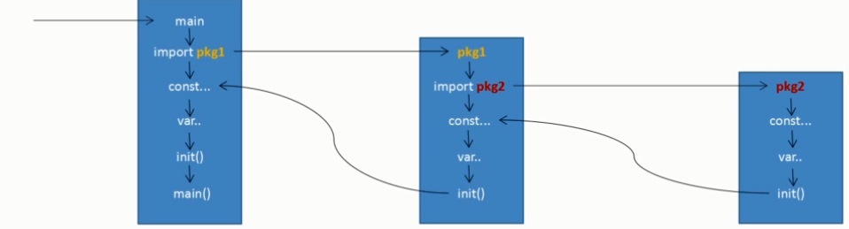

# Go基础语法

**Go 概述**
Go 语言也称 Golang，是谷歌 2009 年发布的第二款开源编程语言，它专门针对多处理器系统应用程序的编程进行了优化，其程序可以媲美 C 或 C++ 代码的速度，而且更加安全、支持并行进程。Go 支持面向对象，而且具有真正的闭包(closures)和反射 (reflection)等功能。Go 可以在不损失应用程序性能的情况下降低代码的复杂性。优点：1、Go 语言从底层原生支持并发，无须第三方库。
2、由于存在并行编程模式，因此这一语言也被设计用来解决多处理器的任务。

**Go适合用来做什么**
1、服务器编程，以前你如果使用 C 或者 C++ 做的那些事情，用 Go 来做很合适，例如处理日志、数据打包、虚拟机处理、文件系统等；
2、分布式系统，数据库代理器等；
3、网络编程，这一块目前应用最广，包括 Web 应用、API 应用、下载应用；
4、内存数据库，前一段时间 google 开发的 groupcache，couchbase 的部分组建；
5、云平台，目前国外很多云平台在采用 Go 开发，CloudFoundy 的部分组建，前 VMare 的技术总监自己出来搞的 apcera 云平台。

**要熟悉 Go 语言中的几大基本数据类型：指针（ * ）、数组、函数、结构体（struct）、联合体（union）、切片、接口（interface）、Map（字典）、Channel。**
参考：[菜鸟教程](https://www.w3cschool.cn/go/)
建议：不要像看资料一样从头撸到尾，会很晕没有效果，去找一些面试题，或者 Go 的练习，问什么，就去查，你会发现要弄懂一个知识点，又要去看其他知识点，这样慢慢看完整个 W3C 的文档。
```Go
package main//申明这个文件属于哪个包，必须放在第一行！且如果这是一个运行文件（即包含main函数的文件），则必须是 main 包。

import (//可以导入需要的包，调用包中的函数。注意中间没有逗号和分号。
	"fmt"
	"unsafe"
)

func main(){
	var i = 1
	fmt.Print(unsafe.Sizeof(i))
}
```

**package 包**
1、package 是最基本的分发单位和工程管理中依赖关系的体系，同一个目录下可以有多个 .go 文件，但是只能有一个包；
2、每个 Go 语言源代码文件开头都拥有一个 package 声明，**表示源码文件所属代码包**；
[意思是：package包必须在源代码文件开头，表示源码文件所属的代码包是什么]
3、要生成 Go 语言可执行程序，必须要有 main 的 package 包，且必须在该包下有 main() 函数；只有 package 名为 main 的包可以包含 main 函数；
4、同一个路径下只能存在一个 package，一个 package 可以拆成多个源文件组成；

**import 命令**
1、import后面跟的是包的路径，而不是包名，不能是 main 包；
2、如果你导入了一个 package 包，但是没用到， GO 语言编译器会报编译错误，不用还瞎导入；
3、如果一个 main 导入其他包，包将被顺序导入，按照你写的顺序；
4、如果导入的包中依赖其它包 B，会首先导入 B 包，然后初始化 B 包中常量和变量，最后如果 B 包中有 init，会自动执行 init();
5、所有包导入完成后才会对 main 中常量和变量进行初始化，然后执行 main 中的 init 函数，最后执行 main 函数[可以参考图] ；
6、如果一个包被导入多次，则该包只会被导入一次；[就是包里的init函数只会执行一次]
7、import 包名前加：[别名]-即换一个容易记的名字；[.]-调用该包中函数时，可以省略掉前缀包名；[-导入该包，但是不导入整个包，而是执行该包中init函数，因此无法通过包名调用包中其他函数，此操作常常是注册包中引擎，让外包方便调用；

**main 函数**
1、main 函数不能带参数；2、main 函数不能定义返回值； 3、 main 函数所在的包必须为 main包；4.、main 函数中可以使用 flag 包来获取和解析命令行参数

### 变量声明使用 *var* 关键字；区分大小写

```Go
//全局变量不使用也不会报错。
var x int //第一种，先申明，再赋值
x = 100

var x = 100 //第二种，自动识别变量的类型
var a,b = 1,2

//下面的只能在函数内部使用。并且声明了一定要使用，否则会报错。
x := 100 //第三种，申明和赋值一起，但是不可以是全局变量
x,y,z := 1,2,3 //类型相同的可以一起声明。

//查看变量的类型
fmt.Printf("%T",zero)
```


### for循环的三种形式
```Go
package main
import "fmt"
func main() {
   var b int = 15
   var a int
   numbers := [6]int{1, 2, 3, 5} 
   //和 C 一样。
   for a := 0; a < 10; a++ {
      fmt.Printf("a 的值为: %d\n", a)
   }
   //和 while 一样
   for a < b {
      a++
      fmt.Printf("a 的值为: %d\n", a)
      }
    //和 python 的 enumerate 一样。
   for i,x:= range numbers {
      fmt.Printf("第 %d 位 x 的值 = %d\n", i,x)
   }   
}
```

### switch
switch 语句用于基于不同条件执行不同动作，每一个 case 分支都是唯一的，从上直下逐一测试，直到匹配为止，匹配项后面也不需要再加 break，会自动结束。
switch 后面可以不跟表达式。

### select
golang 的 select 就是监听 IO 操作，当 IO 操作发生时，触发相应的动作。 
在执行 select 语句的时候，运行时系统会自上而下地判断每个 case 中的发送或接收操作是否可以被立即执行(立即执行：意思是当前 Goroutine 不会因此操作而被阻塞)
select 的用法与 switch 非常类似，由 select 开始一个新的选择块，每个选择条件由 case 语句来描述。与 switch 语句可以选择任何可使用相等比较的条件相比，select 有比较多的限制，其中最大的一条限制就是每个 case 语句里必须是一个 IO 操作，确切的说，应该是一个面向 channel 的 IO 操作。


### 数组
```Go
package main
import 	"fmt"

func main(){
	var arr [10]int //一维数组
    var arrs [5][5]int //二维数组，很常规没啥。
	var nums = [10]int{0,1,2}//如果中括号不写数字，数组大小为 3
    
	fmt.Println(nums[3])//后面默认值为 0
	for i := 0; i < 10; i++{
		arr[i] = i
	}
	for _ , temp := range x{//数组和切片一样，在使用 range 遍历时会生成 2 个值，索引和值。
		fmt.Println(temp)
	}
}
```

### string
```Go
package main
import "fmt"
func main(){
	str := "aA"
	for i := 0; i < len(str); i++{
		fmt.Println(str[i]) //输出的是 ASCII 码。
	}
	//不能直接赋值修改，需要将 string 转为 []byte 修改后，再转为 string 即可
	strByte := []byte(str)
	strByte[0] = 'A'
	str = string(strByte)
	fmt.Println(str)
}
```


### 切片（动态数组）
1、Go 数组的长度不可改变，Go 中提供了一种灵活，功能强悍的内置类型切片("动态数组")，切片竟然是一种类型，常和三个函数搭配，使用 make() 函数来创建切片；由 len() 方法获取长度，就是目前数组用了多少容量；计算容量的方法 cap() 可以测量数组的总容量是多少。
2、还有切片的功能，这里是和 python 里的使用方法相同（不！是因为我懒），我就不演示了。
3、数组作为函数值传递，是值传递；将切片作为函数值传递，才是引用传递。
```Go
package main
import 	"fmt"

func printArr(arr []int){//以数组作为参数传值，
	if (arr == nil){//注意空的表示方法
		fmt.Println("数组为空")
	} else {
		fmt.Printf("%d\n%d\n%d\n",len(arr),cap(arr),arr)//输出长度3,容量3，整个数组[0,0,0]
	}
}

func main(){
	arr := make([]int, 3, 5)//构造一个切片
    // arr := []int{1,2,3} 也是一个切片，[]int 是切片类型。
	//fmt.Println(arr[3]) //超出索引界限，虽然容量为 5，但是只初始化了 3 个元素。
	printArr(arr)

	arr = append(arr, 11)//动态数组，肯定可以调整大小啊，追加一个元素。
	fmt.Println(arr)

	var slice [5]int =  [...]int{1,2,3,4,5}//手动创建切片
	fmt.Println(slice[1:3])

	newArr := make([]int, len(arr), cap(arr))
	copy(newArr, arr)//复制
	fmt.Println(newArr)
}
```

**问：下面的 cap 为啥是 8？**
**答**：开始我是搞不懂加一个容量参数有什么意义，这里貌似是切片会将剩余的容量自动赋到另一个数组中，但是赋过去要干什么呢？

```Go
package main
import "fmt"
func main() {
      // 切片截取
     messages := []int { 1,2,3,4,5,6,7,8,9,0 } //创建切片
      messages2 := messages [2:5]
      printSlice( messages2)}

func printSlice ( x []int){
      fmt.Printf( "len=%d cap=%d slice=%v\n", len(x), cap(x), x )}
 //输出：len = 3, cap = 8, slice = [3 4 5] 
```

### Map（不应该叫集合，应该叫字典）
```Go
package main
import (
    "fmt"
)

func main(){
	var NameSex map[string] string//声明变量，默认 map 是 nil，空是不能存放任何值的。
	NameSex = make(map[string]string)//要进行初始化的，否则无法赋值

	//country := map[string][string]{"China":"浙江"} 声明，初始化
	NameSex["tom"] = "男"
	NameSex["mary"] = "女"
	fmt.Println(NameSex)

	sex,state := NameSex["tom"] //查看是否存在，如果不使用两个值，获取参数，则如果不存在，sex 可能为返回相应类型的空值，如 nil, '', false, 0 等。
	fmt.Println(sex,state)
	delete(NameSex, "tom") //没有返回值的函数，不能进行赋值操作，会报错。
}
```


### 输出函数使用 *fmt* 包
```Go
package main
import 	"fmt"
var g = 100
func main(){
	g := "hello!" //会优先使用局部变量，就近原则。
	fmt.Print(g) //输出不带换行
    fmt.Println(g) //输出带换行
    fmt.Printf("C语言输出啊！ %s\n", "是的啊！")//输出也不带换行，但可以这样输出参数。
}
```
* Go 语言程序中全局变量与局部变量名称可以相同，但是函数内的局部变量会被优先考虑。


### 函数
```Go
package main
import	"fmt"

//常规函数
func max(num1 int, num2 int) int{
	if (num1 > num2){//这里不加冒号，加小括号和python不同。
		return num1
	} else {//函数体内一定要加大括号，并且这三个东西要写在一行。
		return num2
	}
}

//返回两个值的函数
func calculate(num1 int, num2 int) (int, int){
	add,minus := 0,0
	add = num1 + num2
	minus = num1 - num2
	return add,minus
}

func main(){
	fmt.Println(max(11,12))
	fmt.Println(calculate(11,10))
}
```
1、Go 语言最少有个 main() 函数。
2、还能返回多个值，优秀。


### 闭包
```Go
package main
import	"fmt"

func getSquence() func() int{//后面的参数不是函数名啊
	i := 0
	return func() int{
		i += 1
		return i
	}
}

func main(){
	nextSquence := getSquence()
	fmt.Println(nextSquence())
	fmt.Println(nextSquence())
	fmt.Println(nextSquence())
}
//输出1 2 3
```
1. Go 语言支持匿名函数，可作为闭包。闭包可以简单理解为夹带了外部变量。如果没有，则和普通函数没什么区别，具体可类比 Python 的装饰器。

### 结构体（struct）
```Go
package main
import 	"fmt"
type Book struct{//这里的变量可以不用加 var 了。
	title string
	author string
	price int
}

//结构体，下面要给它添加方法
type Circle struct{
	radio float64
}

//该 method 属于 Circle 类型对象中的方法
func (c Circle) getArea() float64{
	return 3.14 * c.radio * c.radio
}

func main(){
	var c Circle
	c.radio = 1.0
	fmt.Println(c.getArea())
    
	var book1 Book
	var book2 Book
	book1.title = "语文"
	book2.title = "数学"
	fmt.Println(book1)
	fmt.Println(book2)
}
}//输出 {语文  0} \n {数学  0}
```
1、声明结构体应该会有默认值，字符串为空，数字为0。
2、结构体可以当作参数，也可以构造结构体指针。**使用结构体指针访问结构体成员，使用 "." 操作符**
3、Go 语言中可以为结构体定义方法。


### 接口（interface）
**定义：它把所有的具有共性的方法定义在一起**

**问：interface { } 是可以指向任意对象的 Any 类型,这一说法是否正确。**
**答**：是的。

```Go
package main
import	"fmt"

type Phone interface{//关键字 type，不是 func。
	MyName()//要实现一个接口，必须实现该接口里面的所有方法。否则不能用接口调用。
}
type IPhone struct{
}
type HuaWei struct{
}

func (ph IPhone) MyName(){//给结构体添加接口里的方法。
	fmt.Println("I am IPhone!")
}
func (ph HuaWei) MyName(){
	fmt.Println("I an HuaWei!")
}

func main(){
	var ph Phone
    ph = new(IPhone) //或者写成 ph = &IPhone  或者 ph = IPhone{ } 都可以。
	ph.MyName()
	ph = new(HuaWei)
	ph.MyName()
}
//没啥感觉，不就是将结构体实现的方法，放在一起，然后用一个东西调用。要实现一个接口，必须实现该接口里面的所有方法。
```
interface (接口)是 golang 最重要的特性之一，Interface 类型可以定义一组方法，但是这些不需要实现。并且 interface 不能包含任何变量。简单的说：interface 是方法的集合 interface 是一种类型，并且是指针类型，interface 的更重要的作用在于多态实现。如果一个接口没有任何方法，我们称为空接口，由于空接口没有方法，所以任何类型都实现了空接口，所以可以调用任何类型。
**高级的概念：接口嵌套、类型转换**


### 反射（reflect）有点复杂，晚点再研究
参考：https://www.cnblogs.com/wdliu/p/9222283.html
* **问：Golang支持反射，反射最常见的使用场景是做对象的序列化,这一说法是否正确？**
* **答：**正确

### Go的异常
error 类型是一个接口类型，我们可以在编码中通过实现 error 接口类型来生成错误信息。
参考：https://blog.csdn.net/fwhezfwhez/article/details/79175376


### 并行编程模式

**问：Goroutine与线程的区别？**
**答**：我们在使用 Go 语言进行开发时，一般会使用 goroutine 来处理并发任务。和线程一样，golang 的主函数（其实也跑在一个 goroutine 中）并不会等待其它 goroutine 结束。如果主 goroutine 结束了，所有其它 goroutine 都将结束。
许多人认为 goroutine 比线程运行得更快，这是一个误解。Goroutine 并不会更快，它只是增加了更多的并发性。当一个 goroutine 被阻塞（比如等待 IO），golang 的 scheduler 会调度其它可以执行的 goroutine 运行。与线程相比，它有以下几个优点：内存消耗更少、创建与销毁的开销更小、切换开销更小、
[参考1](https://baijiahao.baidu.com/s?id=1620972759226100794&wfr=spider&for=pc)
[参考2](https://www.cnblogs.com/wdliu/p/9272220.html)

**问：channle的基本概念？**
**答**：[参考](https://cloud.tencent.com/developer/news/347926)

**问：同步 goroutine？**
**答**：由于 goroutine 是异步执行的，那很有可能出现主程序退出时还有 goroutine 没有执行完，此时 goroutine 也会跟着退出。go 提供了 sync （synchronization）包和 channel 来解决同步问题，当然如果你能预测每个 goroutine 执行的时间，你还可以通过 time.Sleep 方式等待所有的 groutine 执行完成以后在退出程序。
```Go
package main

import (
    "fmt"
    "sync"
)

func cal(a int , b int ,n *sync.WaitGroup)  {
    c := a+b
    fmt.Printf("%d + %d = %d\n",a,b,c)
    defer n.Done() //goroutinue完成后, WaitGroup的计数-1
}

func main() {
    var go_sync sync.WaitGroup //声明一个WaitGroup变量
    for i :=0 ; i<10 ;i++{
        go_sync.Add(1) // WaitGroup的计数加1
        go cal(i,i+1,&go_sync)  
    }
    go_sync.Wait()  //等待所有goroutine执行完毕
}
```

**继承调用规则**



