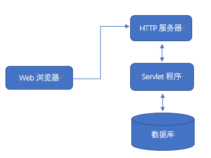
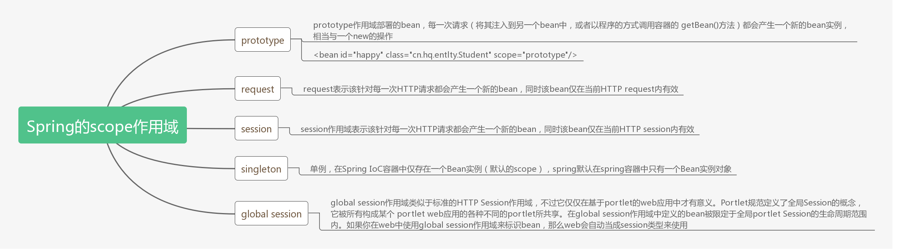

# JAVA-EE
### J2EE 主要技术
[参考博客](https://blog.csdn.net/Neuf_Soleil/article/details/80962686)
JavaEE 号称有十三种核心技术。一般来讲，初学者应该遵循路径 JDBC -> Servlet -> JSP -> Spring -> 组合框架。
Java Web包括四大核心知识点：1.Spring的IOC和AOP等知识点、2.Spring MVC框架的基本流程、3.ORM技术（了解 Hibernate与MyBatis的基本开发流程）、4.Spring MVC+MyBatis、
Java Web可以延后学习的知识点：JSP、Struts MVC、JS、CSS等前端知识

<a href="#JDBC">JDBC：JAVA 操作数据库</a>
<a href="#Tomcat">Tomcat：常见的免费 web 服务器</a>
<a href="#Servlet">Servlet：用于处理用户提交的数据</a>
<a href="#JPS">JSP：可以写 java 代码的 html</a>


### JDBC
<a name="JDBC"></a>
```java
import java.sql.Connection;
import java.sql.DriverManager;
import java.sql.Statement;
import java.sql.SQLException;
public class test {
	public static void main(String[] args) {
		try{
			Class.forName("com.mysql.jdbc.Driver");//加载数据库驱动类，在引入的 jar 包中
		}catch(ClassNotFoundException e) {//此异常无需引包
			e.printStackTrace();
		}
		//建立与数据库的连接，获取 statement 对象，执行 SQL 语句
		//放在try 里面，是关闭流，执行完自动关闭，否则需要手动关闭
        //3306-mysql专用端口号，school-数据库名称，root-用户名，1234-密码。
		try (Connection con = DriverManager.getConnection("jdbc:mysql://127.0.0.1:3306/school?characterEncoding=UTF-8",	"root","1234");	Statement s = con.createStatement();){
			//执行 SQL 语句，字符串用单引号。
			String insert = "insert into students value(5,'王五',1,26,1,curdate());";
             String delete = "delete from students where age = 25;";
			String update = "update students set age = 24 where id = 1; ";
			s.execute(update);
             for(int i=2; i<100; i++) {//for循环插入多条语句，注意 '%s'，
				insert = String.format("insert into hero value(%d,'%s',%d,%d);", 				                    i,"hero"+i,100+i,50+i);
				s.execute(insert);
				System.out.println("执行完"+i);
			}
		} catch(SQLException e) {
			e.printStackTrace();
		} 
	}
}

//SELECT	由于 select 语句会有返回值，所以单独列出
import java.sql.ResultSet;
ResultSet rs = s.executeQuery(select);
while(rs.next()){
    //可以根据字段名称，或者序号从 1 开始，获得返回值。
    int id = rs.getInt("id"); 
    String name = rs.getString(2);
    System.out.printf("id: %d, name: %s\n",id,name);
}

//SQL语句判断账号密码是否正确：错误的做法是把所有数据加载进内存，应该去数据库中查找
if(rs.next())
    System.out.println("账号密码正确");

/*
Statement 和 PreparedStatement 比较
Statement 需要进行字符串拼接，可读性和维护性比较差，
改进 PreparedStatement，1可读性更好，2有预编译机制，速度更快。3防止SQL注入攻击。
*/
Statement s = con.createStatement();
s.execute(sql);//这个sql语句需要拼接 sql = 'a'+i;
PreparedStatement ps = con.prepareStatement(sql);
//这里sql = insert into hero values(?,?,?)，会进行预编译，之后除了参数其他语句都无效
ps.setString(1,"张三");
ps.setInt(2,25);
ps.execute();


/*
execute 与 executeUpdate 的区别
不同1：
execute可以执行查询语句
然后通过getResultSet，把结果集取出来
executeUpdate不能执行查询语句
不同2:
execute返回boolean类型，true表示执行的是查询语句，false表示执行的是insert,delete,update等等
executeUpdate返回的是int，表示有多少条数据受到了影响
*/
s.execute(sqlSelect);
ResultSet rs = s.getResultSet();
while (rs.next()) 
    System.out.println(rs.getInt("id"));

/*
事务	只有所有操作都正确执行，事务才发生
MYSQL 表的类型必须是INNODB才支持事务
相关操作主要有四种：
*/

c.setAutoCommit(false); //自动提交关闭
s.execute(sql1);
s.execute(sql2);
c.commit();// 手动提交,提交一个事务
begin();//开始一个事务
rollback();//回滚一个事务
prepare();//准备提交一个事务


/*
ORM=Object Relationship Database Mapping 
对象和关系数据库的映射 ,简单说，一个对象，对应数据库里的一条记录
对象的属性，就是数据库中不同的字段
DAO = DataAccess Object，把数据库相关的操作都封装在这个类里面，其他地方看不到JDBC的代码。
*/

/*
数据库连接池
当有多个线程，每个线程都需要连接数据库执行SQL语句的话，那么每个线程都会创建一个连接，并且在使用完毕后，关闭连接。创建数据库连接和关闭数据库连接的过程也是特别消耗系统资源的，当多线程并发的时候，系统就会变得很卡顿。
同时，一个数据库同时支持的连接总数也是有限的，如果多线程并发量很大，那么数据库连接的总数就会被消耗光，后续线程发起的数据库连接就会失败。

与传统方式不同，连接池在使用之前，就会创建好一定数量的连接。如果有任何线程需要使用连接，那么就从连接池里面借用，而不是自己重新创建.使用完毕后，又把这个连接归还给连接池供下一次或者其他线程使用。倘若发生多线程并发情况，连接池里的连接被借用光了，那么其他线程就会临时等待，直到有连接被归还回来，再继续使用。整个过程，这些连接都不会被关闭，而是不断的被循环使用，从而节约了启动和关闭连接的时间。
*/

/*错误1：如果没有包名，则请删除 module-info.java 这个文件。


*/

```
**导包**
访问MySQL数据库需要用到第三方的类，这些第三方的类，都被压缩在一个叫做Jar的文件里。
为了代码能够使用第三方的类，需要为项目导入mysql的专用Jar包。通常都会把项目用到的jar包统一放在项目的lib目录下，然后在eclipse中导入这个jar包，所以由此可以看出 lib 文件夹下的包其实是作为仓库使用的。

问：JDBC事务与JTA事务的区别？
JDBC事务缺点：事务的范围局限于一个数据库连接。一个 JDBC 事务不能跨越多个数据库。JTA 事务提供了跨数据库连接（或其他JTA资源）的事务管理能力。这一点是与JDBC Transaction最大的差异。JDBC事务由Connnection管理，也就是说，事务管理实际上是在JDBC Connection中实现。事务周期限于Connection的生命周期。同样，对于基于JDBC的ibatis事务管理机制而言，事务管理在SqlMapClient所依托的JDBC Connection中实现，事务周期限于SqlMapClient 的生命周期。

JTA事务管理则由 JTA容器实现，JTA容器对当前加入事务的众多Connection进行调度，实现其事务性要求。JTA的事务周期可横跨多个JDBC Connection生命周期。


### TomCat
<a name="TomCat"></a>
[安装 TomCat](https://www.cnblogs.com/limn/p/9358657.html)
简介：常见的免费 web 服务器。
启动：F:\JavaWorkSpace\apache-tomcat-9.0.26\bin\startup.bat
注意：每次修改源文件或者其他文件都要重新启动。
修改：F:\JavaWorkSpace\apache-tomcat-9.0.26\conf\server.xml
[server.xml文件详解](https://blog.csdn.net/qq_35713827/article/details/82585539)
1、可以修改里面的端口号，ctrl+f，找到8080，改为80后，访问网页不需要显示给出。
2、可以添加Context，里面的 Context 会将访问的 ip 地址指向一个项目的 web 文件夹下（可以是本地的任意文件夹里面有对应的网页即可.html），（或者一个Web项目然后通过里面的 web.xml 找到对应 classes/Servlet.class 文件进行相应的处理。记住不是.java 文件，服务器会找到.class文件进行处理，开始创建这个项目更改了 .class 文件的路径，所以需要重新编译这个项目，重新生成 .class文件（找了老半天的错误，总是404，后来才发现是没有 .class 文件））
右击工程 -> properties -> java compiler -> Enable project specific settings[打钩] -> compiler compliance level 改成11。之后，eclipse会问你是否重新编译，当然选是，要得就是这个问题。

```xml
<!-- 这里要访问就需要写127.0.0.1:8080/tomcat/login.html，或者其他网页，但是前面的路径不可以改动，端口号可以改。docBase:即网页存放的文件夹路径，可以是普通文件夹，或者是一个web项目。
-->
<Context path="/tomcat/" docBase="F:\\JavaWorkSpace\\apache-tomcat-9.0.26\\webapps\\ROOT" debug="0" reloadable="false" />  
```

### Servlet
<a name="Servlet"></a>

[ 参考博客](https://learner.blog.csdn.net/article/details/81091580)

简介：Servlet用于处理用户提交的数据，熟悉 request 和 response 两种方法，了解不同的跳转方式。熟悉 servlet 对数据库的基本操作。
Servlet 本身不能独立运行，需要在一个 web 应用中运行，而一个 web 应用是部署在 tomcat 中的，所以开发一个 servlet 需要如下三个步骤：

**一、创建 web 应用项目（练习中使用创建单纯的java项目的方式）**；
1.1、创建一个单纯的JavaProject，里面只包含：
1、JRE System Library文件夹：包含各种jar包
2、src：空文件夹
1.2、确定servlet必须的包，需要导入包，导入之后多了一个Referenced Libraties。
（可以创建一个bin文件夹，把需要的jar包放里面，再加载，这样移动项目不容易出错）
右键点击项目 -> properties -> Java Build Path ->Libraries -> Add External JAR
里面有两个路径：一个是Modulepath，一个是Classpath。ModulePath 的概念和ClassPath 类似，不过 ModulePath 中的 Jar 包或 Jmod 文件被当作 Module 来处理，而 ClassPath 中的 Jar 包，无论是否模块化都会被当作传统 Jar 包处理，所以要加在Classpath下面。
1.3、创建一个HelloServlet.java文件，不写包名，用default package即可。
1.4、创建两个web文件夹，web/WEB-INF文件夹，再在WEB-INF文件夹中创建web.xml文件。
1.5、在web/WEB-INF创建classes文件夹，把项目的class文件输出由原来的 j2ee/bin 设置到 j2ee/web/WEB-INF/classes下。项目右键->properties->Java Build Path->Source->右下角的 Brower-> 指定位置是 j2ee/web/WEB-INF/classes。
经历上面一步后，classes文件夹默认不显示了，想看的话可以到源文件中查看。

二、编写HelloServlet.java代码和web.xml代码
```java
import java.io.IOException;
import java.util.Date;

import javax.servlet.http.HttpServlet;
import javax.servlet.http.HttpServletRequest;
import javax.servlet.http.HttpServletResponse;
public class HelloServlet extends HttpServlet{
	public void doGet(HttpServletRequest request, HttpServletResponse response) {
		try {
			response.getWriter().println("<h1>Hello 111 Servlet Hello!</h1>");
			response.getWriter().println(new Date().toLocaleString());
		}catch(IOException e) {
			e.printStackTrace();
		}
	}
}
```

```xml
<?xml version="1.0" encoding="UTF-8"?>
<web-app>
	<servlet>
	<servlet-name>HelloServlet</servlet-name>
	<servlet-class>HelloServlet</servlet-class>
	</servlet>
	<servlet-mapping>
	<servlet-name>HelloServlet</servlet-name>
	<url-pattern>/hello</url-pattern>
        <!-- 如果里面的是/hello.html，则访问的时候必须加后缀！ -->
	</servlet-mapping>
</web-app>
```

三、部署到 tomcat 中；（本地项目中j2ee为示范项目，可以参考如何将java项目部署到tomcat中，其实是在server.xml文件中增加一个Context标签，标明路径）

四、过程：浏览器输入 http://127.0.0.1:8080/pureProject/helloOne 地址，通过 TomCat 免费服务器（里面的 cof/server.xml 文件设置访问的 WEB-INF 文件的路径，即通过浏览器可以访问到的文件夹），文件夹中包含web.xml，里面设置了不同访问路径所对应的不同servlet，找到后到classes 文件夹中寻找指定的class文件（即编译后的java文件），然后返回给浏览器。

四、奇怪的一点是每次修改java项目里面的.java文件，都要重新启动Tomcat，浏览器读取的是上一次修改的.class文件，不明白（应该读取的是缓存的文件）。如果使用hello.html访问，则也会无法访问。因为访问路径要和web.xml里面的映射完全一致。

**采用动态Web项目-Dynamic Web Project的方式将Servlet和Tomcat组合在一起**
一、新建Dynamic Web Project，反正里面一大堆东西，看也看不懂，一共六个大的文件。
File->New->Other->Web->Dynamic Web Project

二、常规的新建HelloServlet，引入JAR包，会多出来一个Reference Libraries文件夹，存放引入的包。创建HelloServlet.java，创建web.xml，常规操作，代码不变。

三、接下来就是在eclipse中配置Tomcat并启动（记住，这里和servert.xml文件无关了，不需要配置），这个需要好几个步骤完成。
首先右键项目 -> Run As -> Run on Server。原来只有动态web项目才有 这个选项，普通java项目是没有这个选项的（这里好像不需要配置server.xml文件）。
注意：需要注意的是，因为在上一步部署的时候，使用的是j2ee这个配置，所以这里访问的时候有路径名称j2ee,与 前面的独立Tomcat部署方式不一样，那个没有j2ee这个路径。所以这里需要
127.0.0.1:8080/j2ee/hello，才可以访问。
错误-无法启动Tomcat：我的web.xml竟然写错了，翻看了错误提示看到的！
错误-可以启动但无法找到servlet：果然还是我的web.xml写错了，但我不知道哪里错了！！！！

四、注意
1. 类文件会被输出到build里，而不是WEB-INF/classes目录下

2. 当有类或者配置文件变化时，会自动重启，无需手动重启Tomcat. 但是不稳定，当很许多类改动，新加了jar包，新增加了配置文件等等，都有可能导致自动重启失效，所以最好还是手动重启，确保重启成功。

3. WebContent会被整个复制到 E:\project\.metadata\.plugins\org.eclipse.wst.server.core\tmp0\wtpwebapps\j2ee 这个位置下面去，Eclipse中启动的tomcat其实是访问的这个位置。所以当WebContent里的内容比较多的时候，就会花较长时间复制。

4. 因为第3条的原因，第1条在build里生成的类和配置文件，也会被复制到第3条所说的位置

   

一、开发 Servlet，打开 TomCat，访问地址为：http://127.0.0.1:8080/hello
对应的servlet中有doGet方法，即执行 web 浏览器的请求的get方法。
二、获取参数，访问地址为：http://127.0.0.1:8080/login.html
通过html文件继续访问，点击提交后会执行对应的servlet中doPost方法。
三、如果浏览器是 GET 请求，那么服务端是 Response 给予响应；
如果浏览器是 POST 表单，那么服务端是 Request 获取信息；
四、继承 HttpServlet 的同时，也继承了一个 service 方法，判断是执行 doPost 还是 doGet，可以直接重写该方法，那么就不需要判断了。三者参数相同。
五、获取中文，添加：request.setCharacterEncoding("UTF-8"); 
响应中文，添加：response.setContentType("text/html; charset=UTF-8");

六、Servlet的生命周期：
servlet接口定义了servlet的生命周期方法：init（）、service（）、destory（）三个方法，具体下见代码。
实例化：在路径找到对应的servlet后，如发现没有实例（即第一次调用），则会调用该类的默认构造方法，且只会执行一次，因为是单例的。
初始化：init 方法是一个实例方法，所以会在构造方法执行后执行。Servlet是单例的，所以只会初始化一次。
提供服务：在service()中编写业务代码。
销毁destroy()：如下情况会调用 1该Servlet所在的web应用重新启动，2关闭tomcat的时候 destroy()方法会被调用
被回收：被销毁后就会很快被回收

七、服务端跳转页面，并返回给客户端：（路径不变，只是将内容传递过去）
request.getRequestDispatcher("success.html").forward(request, response);
或者直接通知客户端自己进行跳转：response.sendRedirect("fail.html");
八、Servlet 自启动

**问：Java Servlet 与使用 CGI（Common Gateway Interface，公共网关接口）有什么优势**：

1. 性能明显更好。
2. Servlet 在 Web 服务器的地址空间内执行。这样它就没有必要再创建一个单独的进程来处理每个客户端请求。
3. Servlet 是独立于平台的，因为它们是用 Java 编写的。
4. 服务器上的 Java 安全管理器执行了一系列限制，以保护服务器计算机上的资源。因此，Servlet 是可信的。
5. Java 类库的全部功能对 Servlet 来说都是可用的。它可以通过 sockets 和 RMI 机制与 applets、数据库或其他软件进行交互。

**问：当多个请求同时到达时，会启动一个还是多个Servlet？**
Servlet是单实例，多线程。1、可以有多个Servlet来处理请求，2、Servlet是单实例的，所以对于同一种业务请求，只有一个实例。3、同一个Sevlet可以同时处理多个客户端的请求，如多个登录同时到达，可以启动多个Servlet线程进行处理。Servlet线程不安全。

**问：在开发servlet继承HttpServlet时如何处理父类的service方法？**
答：一般我们都是不对service方法进行重载(没有特殊需求的话)，而只是重载doGet()之类的doXxx()方法，减少了开发工作量。但如果重载了service方法，doXXX()方法也是要重载的。即不论是否重载service方法，doXXX()方法都是需要重载的。
[额外知识补充](https://my.oschina.net/dtkking/blog/89443)

```java
//
import java.io.IOException;
import java.io.PrintWriter;//response返回html的类

import javax.servlet.ServletException;
import javax.servlet.http.HttpServlet;//需要继承的类
import javax.servlet.http.HttpServletRequest;//处理POST
import javax.servlet.http.HttpServletResponse;//处理GET
public class HelloServlet extends HttpServlet{

//构造函数，当有浏览器访问该Servlet时，会调用此构造函数实例化，且只会执行一次。
public HelloServlet(){}
    
/*import javax.servlet.http.httpservletrequest，你看这个包说明servlet是一个特殊的Java类， java和javax都是Java的API包，java是核心包，javax的x是extension的意思，也就是扩展包。
服务端初始化，肯定在构造函数之后执行，且只会执行一次
*/
public void init(ServletConfig config) {//服务器启动初始化
		for(int i=0; i<10; i++)
			System.out.println("init of Hello Servlet");
}

/*
实际上，在执行doGet()或者doPost()之前，都会先执行service()
由service()方法进行判断，到底该调用doGet()还是doPost()
可以发现，service(), doGet(), doPost() 三种方式的参数列表都是一样的。
所以，有时候也会直接重写service()方法，在其中提供相应的服务，就不用区分到底是get还是post了。
*/
protected void service(HttpServletRequest request, HttpServletResponse response) throws ServletException, IOException {}
	
	
/*哪些是 get 的方式？
form 默认的提交方式，通过 ip 地址访问，处理请求
*/
public void doGet(HttpServletRequest request, HttpServletResponse response)throw ServletException,IOException{//返回响应
		//响应构造 html 编码,如果有中文第一句不能省。
	    response.setContentType("text/html; charset=UTF-8"); 
  	    response.getWriter().println("<h1>three test!</h1>");
    }
//处理发送的表单，一般在 form 上显示设置 method="post" 的时候
protected void doPost(HttpServletRequest request, HttpServletResponse response)throws IOException,ServletException{//处理表单
    //如果 post 里面有中文，要进行中文编码
    request.setCharacterEncoding("UTF-8");
	String name = request.getParameter("name");//获取表单里对应属性的值
    System.out.println(name);//打印在服务器端

    String html = null;//设置html返回给客户端
    html = "<div style='color:green'>登录成功</div>";
    //如果html编码里有中文，需要进行中文编码
    response.setContentType("text/html; charset=UTF-8"); 
    PrintWriter pw = response.getWriter();
    pw.println(html);
	}
	
/*
进行页面间的跳转：两种，服务端跳转，客户端跳转
服务端跳转：浏览器地址不会变，
发命令让客户端跳转：浏览器地址会改变，
*/
request.getRequestDispatcher("success.html").forward(request, response);
response.sendRedirect("fail.html");//客户端跳转
}

/*Servlet 自启动
在 web.xml 中，在某个servlet方法 <servlet-class> 下增加一句
<load-on-startup>10</load-on-startup>
取值范围是1-99，即表明该Servlet会随着Tomcat的启动而初始化，即启动服务器时会自动初始化该servlet方法，调用该类的构造方法和init方法。
<load-on-startup>10</load-on-startup> 中的 10 表示启动顺序
如果有多个Servlet都配置了自动启动，数字越小，启动的优先级越高
*/


/*
Request的方法
*/
request.setCharacterEncoding("UTF-8");//设置表单值的中文编码
request.getParameter("name");//获取表单属性值
//服务端跳转网页
request.getRequestDispatcher("success.html").forward(request, response);
request.getRequestURL();//浏览器发出请求时的完整URL，包括协议 主机名 端口
request.getRequestURI();//浏览器发出请求的资源名部分，去掉了协议和主机名
request.getQueryString();//请求行中的参数部分
request.getRemoteAddr();//浏览器所处于的客户机的IP地址
request.getRemoteHost();//浏览器所处于的客户机的主机名
request.getRemotePort();//浏览器所处于的客户机使用的网络端口
request.getLocalAddr();//服务器的IP地址
request.getLocalName();//服务器的主机名 
request.getMethod();//得到客户机请求方式

/*
Response的方法，返回html元素
*/
response.setContentType("text/html; charset=UTF-8");//设置html的中文编码
response.getWriter().println(html);//获取返回html的对象
response.sendRedirect("fail.html");//客户端跳转网页
```


### Servlet 的 CRUD操作
```java
/*
ORM=Object Relationship Database Mapping 
对象和关系数据库的映射 ,简单说，一个对象，对应数据库里的一条记录
对象的属性，就是数据库中不同的字段
DAO = DataAccess Object，把数据库相关的操作都封装在这个类里面，其他地方看不到JDBC的代码。
*/

```


### JSP
<a name="JPS"></a>
到这里，大家对使用 Servlet 进行CRUD开发就有比较全面感性认识了。 其中一个比较明显的弊端就是在 Servlet 编写 html 代码很痛苦，效率不高，可读性差，难以维护。最好可以在 html 文件里面写html 代码，同时又能在里面调用 java 的变量，那么这样就需要学习 JSP 了。
全称（Java Server Pages）是一种动态网页开发技术。它使用 JSP 标签在 HTML 网页中插入 Java 代码。标签通常以 <%开头以%> 结束。与 JavaScript 相比：虽然 JavaScript 可以在客户端动态生成 HTML，但是很难与服务器交互，因此不能提供复杂的服务，比如访问数据库和图像处理等等。 

**如何写.jsp文件**：在JSP页面里，剥离与显示无关的代码，一个好的JSP页面，应该少用甚至不用<%%>包含起来的代码。

**执行过程**：把 hello.jsp 转译为 hello_jsp.java 文件，这个文件继承了 HttpServlet，所以它就是一个Servlet，之后的处理就都是一样的了，编译为 class 文件，处理响应等等。

**JSP 和 Servlet 的区别**
从网络三层结构的角度看 JSP 和 Servlet 的区别，一个网络项目最少分三层：data layer(数据层)，business layer(业务层)，presentation layer(表现层)。当然也可以更复杂。Servlet 用来写 business layer 是很强大的，但是对于写  presentation layer  就很不方便。JSP 则主要是为了方便写 presentation layer 而设计的。综上所述，Servlet 是一个早期的不完善的产品，写 business layer 很好，写 presentation layer 就很臭，并且两层混杂。
所以，推出 JSP+BEAN，用 JSP 写 presentation layer，用 BEAN 写 business layer。SUN 自己的意思也是将来用 JSP 替代 Servlet。这是技术更新方面 JSP 和 Servlet 的区别。可是，这不是说，学了 Servlet 没用，实际上，你还是应该从 Servlet 入门，再上 JSP，再上 JSP+BEAN。
强调的是：学了JSP，不会用 Java BEAN 并进行整合，等于没学。大家多花点力气在 JSP+BEAN 上。
**常见容器**：Tomcat, Jetty, resin, Oracle Application server, WebLogic Server, Glassfish, Websphere, JBoss 等等。（提供了 Servlet 功能的服务器，叫做 Servlet 容器。对 web 程序来说，Servlet 容器的作用就相当于桌面程序里操作系统的作用，都是提供一些编程基础设施）


```jsp
<%@page contentType="text/html; charset=UTF-8" pageEncoding="UTF-8" import="java.util.*" %>

<%-- 日期，相当于 response.getWriter()，前面带 = 属于需要输出的内容，不用分号结尾
如果没有则表示正常的 java 代码，需要用分号结尾 --%>
<%-- JSP中有不少内嵌对象，不用定义可以直接使用，如request，response，Session，out --%>

<%= new Date().toLocaleString() %>


<%-- java 代码需要加分号 --%>
<%
List<String> words = new ArrayList<>();
words.add("I"); 
words.add("am");
words.add("a");
words.add("good");
words.add("boy");
%>

<%-- 输出一个表格 --%>
<table width="200px" align="center" border="1" cellspacing="0">
<% for (String word : words) { %>
<tr>
    <td><%=word%></td>
</tr>
<% } %>
</table>


<%-- include 使用模板页 ，footer.jsp，并传递参数 --%>
<%@include file="footer.jsp" %> <%-- 指令，编译像宏，且变量模板页可以任意访问 --%>
<jsp:include page="footer.jsp"> <%-- 动作，编译像函数，会调用 --%>
	<jsp:param name="year" value="2017"/> <%-- 这里最后的斜杠总是忘记，模板页需要获取参数才可使用 --%>
</jsp:include>
<p style="text-align:center">copyright@<%=request.getParameter("year")%></p>

<%-- 跳转页面，可以使用 servlet 的代码，下面是 jsp 的服务端跳转--%>
<jsp:forward page="hello.jsp" />
<%-- 客户端跳转和在原servlet中不变--%>
<%    response.sendRedirect("hello.jsp"); %>

<%@page language="java" contentType="text/html; charset=UTF-8" pageEncoding="UTF-8" import="javax.servlet.http.Cookie">
<%-- 设置 (属性，值)，生存时间，保存路径 --%>
<%
Cookie c = new Cookie("name", "gareen");
c.setMaxAge(24*60*60); 
c.setPath('/');
response.addCookie(c);
%>

<%-- 获取 Cookie --%>
<%
Cookie[] cookies = request.getCookies();
if(cookies != null)
	for(int i=0; i<cookies.length; i++)
        out.print(cookies[i].getName()+":"+cookies[i].getValue());
%>

<%-- 引入 javax.servlet.http.Cookie 就包含session --%>
<%
session.setAttribute("name", "gareen");
String name = (String)getAttribute("name");
%>

<%-- 九种隐式对象：不需要显示定义，直接就可以使用的对象
out：输出 <% out.println("hello jsp");%>
page：表示当前对象
request：请求
response：响应
session：会话作用域

pageContext：当前页面作用域
application：全局作用域

config：可以获取一些在 web.xml 中初始化的参数。
exception：只有当前页面的<%@page 指令设置为isErrorPage="true"的时候才可以使用。

JSP有4个作用域，分别是
pageContext 当前页面的jsp页面，跳转就访问不到了
request 一次请求，结束数据即被回收。注意：客户端跳转，浏览器会发生一次新的访问，新的访问会产生一个新的request对象。所以页面间客户端跳转的情况下，是无法通过request传递数据的。（可以使用服务器跳转）
session 当前会话可以任意访问，但是不能共享不同用户的数据。
application 全局，所有用户共享
--%>


<%-- JSTL JSP Standard Tag Library 标准标签库 --%>
<%@ taglib uri="http://java.sun.com/jsp/jstl/core" prefix="c"%>
<c:set var="name" value="${'gareen'}" scope="request" />
通过标签获取name: <c:out value="${name}" /> <br>
<c:remove var="name" scope="request" /> <br>

<c:if test="${hp<5}">
    <p>这个英雄要挂了</p>
</c:if>
<c:if test="${!(hp<5)}">
    <p>这个英雄觉得自己还可以再抢救抢救</p>
</c:if>

<c:forEach items="${heros}" var="hero" varStatus="st"  >
    <tr>
        <td><c:out value="${st.count}" /></td>
        <td><c:out value="${hero}" /></td>
    </tr>
</c:forEach>


<%-- EL 表达式--%>
通过标签获取name: <c:out value="${name}" /> <br>
通过 EL 获取name: ${name}
英雄名字 ： ${hero.name} <%-- 会自动调用 get,set 方法--%>
英雄血量 ： ${hero.hp}


```

**Cookie**：Cookie 是一种浏览器和服务器交互数据的方式。Cookie 是由服务器端创建，但是不会保存在服务器。创建好之后，发送给浏览器。浏览器保存在用户本地。下一次访问网站的时候，就会把该 Cookie 发送给服务器。

**Session**：Session对应的中文翻译是会话。会话指的是从用户打开浏览器访问一个网站开始，无论在这个网站中访问了多少页面，点击了多少链接，都属于同一个会话。 直到该用户关闭浏览器为止，都属于同一个会话。

盒子对应服务器上的 Session，十五分钟或者半小时没有访问过可能会清除，钥匙（SessionID）对应保存在浏览器上的 Cookie。通过钥匙可以找到盒子，会在第一次访问创建一个sessionID，返回给你保存在 Cookie 里，等再次访问时，服务端取出 ID。如果没有 Cookie 那么每次只能重新生成 session。

### MVC
Servlet 相当于在 Java 代码里面写 html，肯定很繁琐，所有html都是字符串拼接起来的。
JSP 相当于在 HTML 里面写代码，用两个%括起来，所有的变量也要括起来，也很麻烦。
所以单独用一个做很繁琐，就将两个的优势结合，就是MVC的思想。
Modle 模型-数据（DAO,Bean），View 视图-网页（JSP），Controller 控制器（Servlet）。
其中可以看出，是视图是.jsp，控制器和模型都是 .java文件，除了web.xml。接下来学习JSP+Bean

```java
/*
Servlet 只用来从数据库中查询 Hero 对象，然后跳转到 JSP 页面，如果保存在request，需要服务器跳转，因为它的有效期是一次会话。
*/
<%-- controlerHero.java --%>
int id = Integer.parseInt(request.getParameter("id"));
Hero hero = new HeroDAO().get(id);
request.setAttribute("hero", hero);
request.getRequestDispatcher("editHero.jsp").forward(request, response);

```

```jsp
<%-- viewHero.jsp --%>
<form action='updateHero' method='post'>
    名字 ： <input type='text' name='name' value='${hero.name}'> <br>
    血量 ：<input type='text' name='hp' value='${hero.hp}'> <br>
    伤害： <input type='text' name='damage' value='${hero.damage}'> <br>
    <input type='hidden' name='id' value='${hero.id}'>
    <input type='submit' value='更新'>
</form>
```

### Spring
Spring三大块知识：
一、常规知识点：IOC/DI
二、常规知识点：AOP
二、web应用方面：Spring MVC
三、框架整个技术


**一、IOC 是反转控制 (Inversion Of Control) **
Spring 框架是一个开源的 Java 平台，它为容易而快速的开发出耐用的 Java 应用程序提供了全面的基础设施。
**传统的方式**：通过 new  关键字主动创建一个对象
**IOC 方式**：对象的生命周期由 Spring 来管理，直接从 Spring 那里去获取一个对象，就像控制权从本来在自己手里，交给了 Spring。在主程序调用 xml 文件时，就开始对实例进行初始化构造了，不管是直接写的 bean 还是用注解方式（自动生成一个bean），效果都一样。
该对象默认是单例的，一般用单例模式创造无状态的Bean，而有状态的Bean则不使用单例模式。
无状态的Bean：是指没有能够标识它目前状态属性的Bean，如连接数据库。
有状态的Bean：而如果是登录等，保存个人信息的Bean，则为有状态的Bean。

**问：有状态的Bean和无状态的Bean？**
答：IOC创建的对象默认是单例的，一般用单例模式创造无状态的Bean，而有状态的Bean则不使用单例模式。这里要注意的是singleton作用域和GOF设计模式中的单例是完全不同的，单例设计模式表示一个ClassLoader中只有一个class存在，而这里的singleton则表示一个容器对应一个bean，也就是说当一个bean被标识为singleton时候，spring的IOC容器中只会存在一个该bean。

无状态的Bean：是指没有能够标识它目前状态属性的Bean，如连接数据库。
特点：可以在缓冲池里只维护一个实例，无须创建和销毁操作，性能高，但线程不安全。
有状态的Bean：而如果是登录等，保存个人信息的Bean，则为有状态的Bean。
特点：每次调用创建一个实例，一旦调用结束，如用户离开网站，则该Bean就会被销毁。

**问：Bean的生命周期？**


**IoC的实现原理**：就是工厂模式加反射机制。

**注解方式的IOD和DI：@Autowired**
位置：1、可以在bean里面（通过byName，byType）
2、可以在类的属性上面添加（注解，等同于byType）缺点：1、代码可读性不好，不容易维护，不得不在代码里找依赖关系，2、通用性不好，如果哪天不用Spring了得一个一个删除。

IOC是反转控制 (Inversion Of Control)的缩写，就像控制权从本来在自己手里，交给了Spring。没有使用new，就意味着低耦合，假设有三个团队在开发维护三个类，如果用常规的new方法创造类，那么一旦这个团队修改了调用接口，如构造函数需要带参数，那么导致其他团队也要修改本身的代码。要知道在公司里，修改代码并且发布到生产环境，要经过很繁琐且很严格的审批流程，必须要经历代码审查、代码提交、测试人员测试、领导审批、最终发布等步骤。
依赖注入强调类的注入是由Spring容器在运行时完成，而控制反转强调类之间的关系是由Spring容器控制。

**Spring Scope（作用域）的范围**


```java
public static void main(String[] args) {
/*三种获取配置文件的方式：
* 一、Resource resource = new ClassPathResource("applicationContext.xml");
* BeanFactory factory = new XmlBeanFactory(resource);
* 二、如下
* 三、ApplicationContext factory = new FileSystemXmlApplicationContext("classpath:applicationContext.xml");
* 
* */
    ApplicationContext context = new ClassPathXmlApplicationContext(new String[] { "applicationContext.xml" });

    //Category c = (Category) context.getBean("c");
    Product p = (Product) context.getBean("p");
    Category c = p.getCategory();
    System.out.println(c.getName());

    SingleTon s1 = (SingleTon) context.getBean("s");
    SingleTon s2 = (SingleTon) context.getBean("s");
    s1.printRandom();
    s1.printRandom();
}
```

```xml
<!-- spring 反转控制，在xml中产生实例，在主函数中通过 getBean("c") 获取这个实例。 -->
    <bean name="category" class="com.how2java.pojo.Category">
        <property name="name" value="category 1" />
    </bean>
    
 	<!-- spring 注入对象（DI）,将上一个实例注入到另一个实例中
 	<bean name = "p" class="com.how2java.pojo.Product">
 		<property name="name" value="product 1" />
 		<property name="category" ref="category" />
 	</bean>
 	-->
 	
 	<!-- 通过注解方式,那么类中的属性名要和注入bean的name相同（category）  -->
 	<bean name = "p" class="com.how2java.pojo.Product" autowire="byName">
 		<property name="name" value="product 1" />
 	</bean>
 	
 	<!-- scope可以不写，默认是单例的 -->
 	<bean name = "s" class="com.how2java.pojo.SingleTon" scope="singleton">
 	</bean>


<!-- 只通过注解方式 applicationContext.xml 文件中只需要写两句-->
<!-- 包括bean，属性注入啊等等 -->
@Component("p") 表示一个bean
@Autowired 会自己匹配，容易报错
@Resource("c") 主动匹配bean，也可以
<context:annotation-config/> <!-- 表示通过注解方式 -->
<context:component-scan base-package="com.how2java.pojo"/> <!-- 默认扫描的包 -->
```

**二、AOP 即 Aspect Oriented Program 面向切面编程**
首先，在面向切面编程的思想里面，把功能分为核心业务功能和周边功能。
所谓的核心业务：比如登陆，增加数据，删除数据都叫核心业务
所谓的周边功能（切面）：比如性能统计，日志，事务管理等等
在面向切面编程 AOP 的思想里面，核心业务功能和切面功能分别独立进行开发，然后把切面功能和核心业务功能 "编织" 在一起（在xml文件中编织），这就叫 AOP。在编写切面功能时，有一个核心功能接口 joinpoin（可以调用核心功能），默认在切面方法中将所有功能完成后（如在执行核心功能前后打印开始结束日志），再在 xml 中进行编织（就我理解，这里感觉只是创建两个bean，然后调用，真正的编织感觉在编写切面功能的时候已经做了，xml中负责调用）。

辅助功能，又叫做切面，这种能够选择性的，低耦合的把切面和核心业务功能结合在一起的编程思想，就叫做切面编程。在xml文件里：
首先构造一个核心功能的CutPointBean：这是给主函数调用的。
之后构造一个切面的LoggerAspectBean：方便后面交织，给<aop:config>用的，所以表面上你看不到。之后就在<aop:config>里面构造<aop:pointcut>和<aop:aspect>。

**问：AOP技术优势在于？**
答：将核心关注点与横切关注点完全隔离，面相切面编程，与传统oop相比，传统oop编程是自顶向下的编写主业务逻辑，但往往需要参杂着一些与主业务逻辑无关或关系不大的逻辑，这就产生了横切性问题。Aop能很好的隔离和管理这些与主业务逻辑关联不大的业务代码，使得代码的可读性和可维护性大大提高。

```xml
<!-- 将核心业务功能与切面功能整合：
核心业务类编写照常，切面类需要通过一个核心业务类接口，提前将需要做的任务完成，如在核心业务类前后打印日志等。
接下来在xml中通过两个类构造两个bean，xml中的调用肯定是通过bean来实现的，只要调用核心类中任意的方法，就会触发切面类的bean，具体看以下实现。
-->
<!-- 核心类实例化一个bean，给测试类调用的，此处用不到 -->
<bean name="s" class="spring.ProductService"/>

<!-- 切面类实例化一个bean -->
<bean id="loggerAspect" class="spring.LoggerAspect"/>

<!-- 具体的编织过程 -->
<aop:config>
<!-- 切面类的触发条件，自定义的核心bean，调用任意此类的方法就调用切面类 -->
<aop:pointcut id="loggerCutpoint" 
expression = "execution(* spring.ProductService.*(..)) "/>

<!-- 切面编程的id，绑定的切面bean -->
<aop:aspect id="logAspect" ref="loggerAspect">
<!-- 只要触发了核心bean，那么就调用 log 方法 -->
<aop:around pointcut-ref="loggerCutpoint" method="log"/>
</aop:aspect>
</aop:config>   

<!-- 其实了解了上述构造过程，可以看到，这些只是重复了切面类的功能，用bean来做，
所以我们可以使用注解的方式，重要，因为较为方便快捷。
1在xml文件中添加两句
<context:component-scan base-package="spring"/>
<aop:aspectj-autoproxy/> 
2在切面类添加 @Aspect,@Component,@Around即可
-->
```

### SpringMVC
入口是Servlet。
springmvc的请求流程，我们以一次用户的数据查询为例: 1，用户通过浏览器发送http请求，web容器接收到相关请求调用springmvc的核心控制器DispatcherServlet ，任何路径的映射都是如此；2，DispatcherServlet请求处理器映射器（HandlerMapping），处理器映射器根据 路径 对应的 配置或注解，找到最终要执行的Handler，并返回处理器执行链（HandlerExecutionChain）给DispatcherServlet。 3，DispatcherServlet接收到处理器执行链后请求处理器适配器,（HandlerAdapter）处理器适配器根据Handler规则执行不同的Handler，即我们编写的Controller，执行完成后返回一个ModelAndView对象给DispatcherServlet 5，DispatcherServlet接收数据并调用视图解析器（ViewResolver），视图解析器将逻辑视图解析成真正的物理视图，并返回View对象 6，DispatcherServlet接收到对应的View对象,对视图进行渲染，将model中的数据转为response响应。 7，DispatcherServlet响应用户的请求。

```xml
web.xml
<!-- 用户通过浏览器发送http请求，web容器接收到相关请求调用springmvc的核心控制器DispatcherServlet ，任何路径的映射都是如此 -->
<?xml version="1.0" encoding="UTF-8"?>
<web-app version="2.4" xmlns="http://java.sun.com/xml/ns/j2ee"
    xmlns:xsi="http://www.w3.org/2001/XMLSchema-instance"
    xsi:schemaLocation="http://java.sun.com/xml/ns/j2ee
http://java.sun.com/xml/ns/j2ee/web-app_2_4.xsd">
    <servlet>
        <servlet-name>springmvc</servlet-name>
        <servlet-class>
            org.springframework.web.servlet.DispatcherServlet
        </servlet-class>
        <load-on-startup>1</load-on-startup> 
    </servlet>
    <servlet-mapping>
        <servlet-name>springmvc</servlet-name>
        <url-pattern>/</url-pattern>
    </servlet-mapping>
    
        <!-- 用来显示中文编码 -->
    <filter> 
    <filter-name>CharacterEncodingFilter</filter-name> 
    <filter-class>org.springframework.web.filter.CharacterEncodingFilter</filter-class> 
    <init-param> 
        <param-name>encoding</param-name> 
        <param-value>utf-8</param-value> 
    </init-param> 
    </filter> 
    <filter-mapping> 
        <filter-name>CharacterEncodingFilter</filter-name> 
        <url-pattern>/*</url-pattern> 
    </filter-mapping>  
</web-app>


springmvc-servlet.xml
<?xml version="1.0" encoding="UTF-8" ?>
<!DOCTYPE beans PUBLIC "-//SPRING//DTD BEAN//EN" "http://www.springframework.org/dtd/spring-beans.dtd">
<beans>
    <!-- 视图定位功能，定位WEB-INF下某个文件夹中的文件，且以.jsp结尾,路径只需要文件名即可
 http://localhost:8080/springmvc/index -->
    <bean id="viewResolver" class="org.springframework.web.servlet.view.InternalResourceViewResolver">
   <property name="prefix" value="/WEB-INF/page/" />
   <property name="suffix" value=".jsp" />
</bean>
    

 <!-- 不用注解的方式，指定映射 -->
    <bean id="simpleUrlHandlerMapping"
        class="org.springframework.web.servlet.handler.SimpleUrlHandlerMapping">
        <property name="mappings">
            <props>
<!-- 这是Spring MVC的 映射配置文件，表示访问路径/index会交给id=indexController的bean处理  -->
                <prop key="/index">indexController</prop>
            </props>
        </property>
    </bean>
    <bean id="indexController" class="controller.IndexController"></bean>
</beans>

<!-- 使用注解的方式，@Controller,@RequestMapping(/index); -->
<?xml version="1.0" encoding="UTF-8"?>
<beans>
    <!-- 只增加了这一句，下面是视图定位 -->
    <context:component-scan base-package="controller" />
    <bean id="irViewResolver"
        class="org.springframework.web.servlet.view.InternalResourceViewResolver">
        <property name="prefix" value="/WEB-INF/page/" />
        <property name="suffix" value=".jsp" />
    </bean>
</beans>
```

```java
//使用 Bean 跳转，将模型与视图整合
//使用注解方式：重点，因为很简洁，用的也很多。
@Controller //使用注解的方式
public class IndexController implements Controller {
    @RequestMapping("/index") //和上面的配套使用，不需要再servlet.xml中指定了
    public ModelAndView handleRequest(HttpServletRequest request, HttpServletResponse response) throws Exception {
        System.out.println("已启动");
        //因为有了视图定位（在servlet.xml文件中），所以不需要写后缀，且可以识别指定文件夹的页面
        //默认是访问WEB-INF下的jsp文件的
        //如果要进行客户端跳转，则修改为：ModelAndView("redirect:/index.jsp");
    	ModelAndView mav = new ModelAndView("index");
        mav.addObject("message", "Hello Spring MVC");
        return mav;
    }
}
 
    @RequestMapping("/check")//session的访问次数
    public ModelAndView check(HttpSession session) {
        Integer i = (Integer) session.getAttribute("count");
        if (i == null)
            i = 0;
        i++;
        session.setAttribute("count", i);
        ModelAndView mav = new ModelAndView("check");
        return mav;
    }
}

//如何获取表单数据？前面介绍的都是基于Get返回某个页面，如何获取POST请求？


```


### MyBatis
**基础**
平时我们都用JDBC访问数据库，除了需要自己写SQL之外，还必须操作Connection, Statement, ResultSet 这些其实只是手段的辅助类。 不仅如此，访问不同的表，还会写很多雷同的代码，显得繁琐和枯燥。那么用了Mybatis之后，只需要自己提供SQL语句，其他的工作，诸如建立连接，Statement， JDBC相关异常处理等等都交给Mybatis去做了，那些重复性的工作Mybatis也给做掉了，我们只需要关注在增删改查等操作层面上，而把技术细节都封装在了我们看不见的地方。

**基本原理**
1. 应用程序找Mybatis要数据
2. mybatis从数据库中找来数据
2.1 通过mybatis-config.xml 定位哪个数据库
2.2 通过Category.xml执行对应的select语句
2.3 基于Category.xml把返回的数据库记录封装在Category对象中
2.4 把多个Category对象装在一个Category集合中
3. 返回一个Category集合
```xml
<!-- 配置mybatis-config.xml 连接数据库  -->

<typeAliases> <!-- 配置前缀  -->
   <package name="pojo"/>
</typeAliases>
 <!-- 连接数据库  -->
<property name="driver" value="com.mysql.jdbc.Driver"/>
<property name="url" value="jdbc:mysql://localhost:3306/school?characterEncoding=UTF-8"/>
<property name="username" value="root"/>
<property name="password" value="1234"/>
 <!-- 映射到执行文件  -->
<mappers>
	<mapper resource="mybatis/Category.xml"/>
</mappers>
</configuration>
<!-- 配置 Category.xml  执行sql语句  -->
<mapper namespace="mybatis">
<insert id="addCategory" parameterType="Category" >
insert into category_ ( name ) values (#{name})   
</insert>

<delete id="deleteCategory" parameterType="Category" >
delete from category_ where id= #{id}  
</delete>

<update id="updateCategory" parameterType="Category" >
update category_ set name=#{name} where id=#{id}   
</update>

<select id="getCategory" parameterType="_int" resultType="Category">
select * from   category_  where id= #{id}   
</select>

<select id="listCategory" resultType="Category">
select * from   category_     
</select>    
</mapper>
```
**控制器的代码**
```java

//这里需要在springMVC.xml中添加指定的映射，使用注解参考下一个实例
public class IndexController implements Controller {
    public ModelAndView handleRequest(HttpServletRequest request, HttpServletResponse response) throws Exception {
        System.out.println("已启动");
        //因为有了视图定位，所以不需要写后缀，且可以识别指定文件夹的页面
        //默认是访问WEB-INF下的jsp文件的
    	ModelAndView mav = new ModelAndView("index");
        mav.addObject("message", "Hello Spring MVC");
        return mav;
    }
}


//使用注解的方式，指定控制器和映射
@Controller
public class ProductController {
	@RequestMapping("/addProduct")
	public ModelAndView add(Product product) throws Exception{
		System.out.println("增加商品已启动");
        //在构造函数中添加网页
		ModelAndView mav = new ModelAndView("addProduct"); 
		return mav;
	}
	
	@RequestMapping("/showProduct")
	public ModelAndView show(Product product) throws Exception{
		System.out.println("显示商品");
		ModelAndView mav = new ModelAndView("showProduct");
		mav.addObject("product",product);
		return mav;
	}
}

```


**动态 SQL **
if 标签，可以对 SQL 语句进行控制。
where 标签，可以自动删除多余的 and 和 or。

```xml
<mapper namespace="mybatis">
    <select id="One" resultType="Product">
    select * from product
    <if test="name != null">
    where name like concat('%',#{name},'%')
    </if>        
    </select>

    <select id="Two" resultType="Product">
    select * from product
    <where>
    <if test="name!=null">
    and name like concat('%',#{name},'%')
    </if>        
    <if test="price!=null and price!=0">
    and price > #{price}
    </if>
    </where>     
    </select>
    
    <update id="updateProduct" parameterType="Product" >
        update product
        <set>
            <if test="name != null">name=#{name},</if>
            <if test="price != null">price=#{price}</if>
        </set>
         where id=#{id}   
    </update>
</mapper>
```

### SSM整合
创建过程：由于项目有点大，且不容易理解。
首先按照主体部分是springMVC，然后往里面添加了mybatis+spring。
开始web.xml->pringerMVC->controller。从这里开始，控制器是通过mybatis获取数据库的数据，而不是自己创造或者返回的数据，在使用mybatis获取数据时，又用到了Spring的注解方式的IOC，方便获取数据。然后给Controller，最后控制器添加到页面并显示。


**SpringMVC：SSM框架的主体结构**: WEB-INF/web.xml 将浏览器中所有的请求 路径 映射指定的 springerMVC.xml文件中，该文件中使用注解的方式扫描指定的包，调用指定的Controller。到目前为止SSpringMVC框架里的文件是没有动过的。
然后需要看Controller里面，有Springer的注解，需要找Spring的配置文件applicationContext.xml。
找到对应的Bean后，又发现Bean里面有MyBatis的mapper存在，也是通过文件映射的方式调用的。

**Spring**:src/applicationContext.xml [Spring 的核心配置文件]。里面指定了包，通过注解方式为Controller提供对应的Bean。

**Mybatis**: 连接数据的配置信息放在了src/applicationContext.xml [Spring 的核心配置文件]，包括实体类，数据库连接，DAO方法调用文件，因此，只要有[Spring 的核心配置文件]，就可以调用DAO的方法。

**基本流程**

1. 首先浏览器上访问路径 /listCategory
2. tomcat根据web.xml上的配置信息，拦截到了/listCategory，并将其交由DispatcherServlet处理。
3. DispatcherServlet 根据springMVC的配置，将这次请求交由CategoryController类进行处理，所以需要进行这个类的实例化
4. 在实例化CategoryController的时候，注入CategoryServiceImpl。 (自动装配实现了CategoryService接口的的实例，只有CategoryServiceImpl实现了CategoryService接口，所以就会注入CategoryServiceImpl)
5. 在实例化CategoryServiceImpl的时候，又注入CategoryMapper
6. 根据ApplicationContext.xml中的配置信息，将CategoryMapper和Category.xml关联起来了。
7. 这样拿到了实例化好了的CategoryController,并调用 list 方法
8. 在list方法中，访问CategoryService,并获取数据，并把数据放在"cs"上，接着服务端跳转到listCategory.jsp去
9. 最后在listCategory.jsp 中显示数据

比较难理解的三个文件，三个配置文件：web.xml、applicationContext.xml、springMVC.xml 。

WEB-INF/web.xml：两个作用
1. 通过ContextLoaderListener在web app启动的时候，获取contextConfigLocation配置文件的文件名applicationContext.xml，并进行Spring相关初始化工作。
2. 有任何访问，都被DispatcherServlet所拦截，这就是Spring MVC那套工作机制了。
1映射到applicationContext.xml，2将浏览器中所有的请求 路径 映射指定的 Servlet 和对于的 mvc 配置文件 src/springMVC.xml 。

src/springMVC.xml：主要任务获取数据然后和jsp页面整合返回。
1. 扫描Controller,并将其生命周期纳入Spring管理
2. 注解驱动，以使得访问路径与方法的匹配可以通过注解配置
3. 静态页面，如html,css,js,images可以访问
4. 视图定位到/WEB/INF/jsp 这个目录下

src/applicationContext.xml：主要任务连接数据库，从数据库获取数据。
构造一个<bean>连接数据库，并注入到另一个<bean>，连接Category.java类构造ORM，连接Category.xml让其定义的SQL语句方法可以调用数据库。

大致配置过程是从下到上的三个过程，从mybatis数据库，到SpringMVC，到Spring。使用作者的源文件，修改数据库部分即可。为什么我的项目不行？我唯一的修改即是将包都去掉，整合在一个包下，可能在注解的时候会出现问题吧。