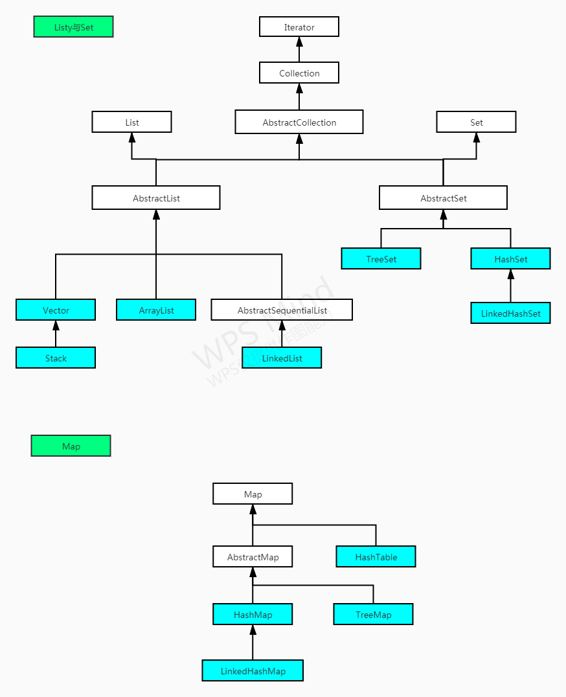

# Java-基础语法

* <a href="#简介">0、简介</a>
* <a href="#第一个 Java 程序">1、第一个 Java 程序</a>
* <a href="#命名与基本方法">2、命名与基本方法</a>
* <a href="#输入输出">3、输入输出</a>
* <a href="#集合框架">4、集合框架</a>
* <a href="#字符串">5、字符串</a>
* <a href="#Java常用内置类">6、Java常用内置类</a>
* <a href="#异常和调试">7、异常和调试</a>
* <a href="#Java常用包">8、Java常用包</a>
* <a href="#泛型">9、泛型</a>
* <a href="#10、正则表达式">10、正则表达式</a>

****
## 0、简介
<a name="简介"></a>
**公司**：由 SUN 公司 詹姆斯-高斯林 开发，后被 甲骨文（Oracle）收购。  

**知名作品**：我的世界、淘宝网、Android 操作系统。  

**Java 容器**：很多繁琐又重复的工作我们可以提前做好，然后调用，但谁来做呢，有个组织出来定义了接口，谁家都可以造轮子，用户想用哪家的都可以，各家自己造的轮子（如Tomcat、GlassFish、IBM WebSphere）就叫做 Java 容器。随着越来越多的企业加入到这个阵营，官方给出的规范组件并不是最受欢迎的，反而一些企业的组件在实际开发中更让人喜欢。  

**Java SE，EE，ME 三者的区别**  
1、开发桌面应用的 Java SE（Java Platform，Standard Edition）  
2、开发 Web 应用的 Java EE（Java Platform，Enterprise Edition）  
3、Android 开发移动应用 和 嵌入式 的 Java ME（Java Platform，Micro Edition）  
4、参考连接：[Java SE EE ME具体区别](https://blog.csdn.net/qq_29611345/article/details/102384776)  

**JAR**： Java 类库的 class 文件。  

**JDK，JRE，JVM 三者的区别**：  

总的来说，JDK 中包含 JRE，因为开发总要运行嘛，而 JRE 又包含 JVM。具体可以打开我们下载的JDK文件夹，里面又包含了一个JRE文件夹。[参考CSDN](https://blog.csdn.net/shaochenshuo/article/details/78507132)  
1、JDK：JDK(Java Development Kit)称为 Java 开发包 或 Java 开发工具，是一个编写 Java 的 Applet 小程序和应用程序的程序开发环境。JDK 是整个 Java 的核心，包括了 Java 运行环境 JRE(Java Runtime Envirnment)，JVM 和 Java 的核心类库(Java API)。  [JDK 不同版本特性](https://blog.csdn.net/qq_22194659/article/details/86134443)  
2、JRE： JRE（Java Runtime Envirnment）运行java程序的环境，JRE里面只有client运行环境，安装过程中，会自动添加PATH。  
3、JVM：Java 虚拟机（Java Virtual Machine），面试考的很频繁，就不多说了。

**Java和C++的区别**：

1. Java是解释型语言，所谓的解释型语言，就是源码会先经过一次编译，成为中间码，中间码再被解释器解释成机器码。对于Java而言，中间码就是字节码(.class)，而解释器在JVM中内置了。
2. C++是编译型语言，所谓编译型语言，就是源码一次编译，直接在编译的过程中链接了，形成了机器码。
3. C++比Java执行速度快，但是Java可以利用JVM跨平台。
4. Java是纯面向对象的语言，所有代码（包括函数、变量）都必须在类中定义。而C++中还有面向过程的东西，比如是全局变量和全局函数。
5. C++中有指针，Java中没有，但是有引用。
6. C++支持多继承，Java中类都是单继承的。但是继承都有传递性，同时Java中的接口是多继承，类对接口的实现也是多实现。
7. C++中，开发需要自己去管理内存，但是Java中JVM有自己的GC机制，虽然有自己的GC机制，但是也会出现OOM和内存泄漏的问题。C++中有析构函数，Java中Object的finalize方法
8. C++运算符可以重载，但是Java中不可以。同时C++中支持强制自动转型，Java中不行，会出现ClassCastException（类型不匹配）。

**Linux、Windows与MAC OS下的换行符**

我使用的是 Windows，提交上来的文档总是不能够换行，导致格式很糟糕，于是就去查了一下，是不是提交上来的换行符有问题。[参考连接](https://ganzhixiong.com/p/fcbdca0f/)

> 历史：为了保证打字机换行时消耗的时间内不会有其它字符进来，主动添加了两个无效字符（回车 换行）。
> 计算机出现后，开始讨论加一个还是两个的问题，注意了 Typora 的软换行在 GitHub 中是无效的，在 Typora 中按下 Shift + Enter 是软换行，按下此组合键后，可以看到换了一行，但是推送到 GitHub 上后，你会发现换行是无效的。要解决这问题，你就要搞清楚空格、软换行、硬换行、换段的在 Typora 中的概念。
>
> Typora 在空格与换行部分主要是使用 [CommonMark](https://commonmark.org/) 作为标注规范。与前文提到的 GFM 一样，CommonMark 也是比较流行的 Markdown 语言规范（解析器）之一。
>
> - **空格**：在输入连续的空格后，Typora 会在编辑器视图里为你保留这些空格，但当你打印或导出时，这些空格会被省略成一个。
>   你可以在源代码模式下，为每个空格前加一个 `\` 转义符，或者直接使用 HTML 风格的 `&nbps;` 来保持连续的空格。
> - **软换行：** 需要说明的是，在 Markdown 语法中，换行（line break）与换段是不同的。且换行分为软换行和硬换行。在 Typora 中，你可以通过 `Shift + Enter` 完成一次软换行。软换行只在编辑界面可见，当文档被导出时换行会被省略。
> - **硬换行：** 你可以通过 `空格 + 空格 + Shift + Enter` 完成一次硬换行，而这也是许多 Markdown 编辑器所原生支持的。硬换行在文档被导出时将被保留，且没有换段的段后距。
> - **换段：** 你可以通过 `Enter` 完成一次换段。Typora 会自动帮你完成两次 `Shift + Enter` 的软换行，从而完成一次换段。这也意味着在 Markdown 语法下，换段是通过在段与段之间加入空行来实现的。
> - **Windows 风格（CR+LF）与 Unix 风格（CR）的换行符：** CR 表示回车 `\r` ，即回到一行的开头，而 LF 表示换行 `\n` ，即另起一行。
>   所以 Windows 风格的换行符本质是「回车 + 换行」，而 Unix 风格的换行符是「换行」。这也是为什么 Unix / Mac 系统下的文件，如果在 Windows 系统直接打开会全部在同一行内。 你可以在 `文件 - 偏好设置 - 编辑器 - 默认换行符` 中对此进行切换。

****
## 1、第一个 Java 程序
<a name="第一个 Java 程序"></a>
```java
// 单行注释
/* 块注释*/
/** 文档注释:注释若干行，并写入javadoc文档*/

/*如果有包需要在第一行注明，注意：导包只可以导当前层，如果里面有包，则包中的类不会导入。
  如：import java.*; 和 import java.util.*; 第一个不可能把所有的包中类全导入。*/
package test; 
import java.util.Scanner; //引入 Java Scanner包
public class test {
    // Java 程序启动函数
    public static void main(String args[]) {
    	String name = "tom";
    	System.out.println(name);
    }
}
/*1.创建源文件 .java
  2.javac 将 .java 源代码转换为 JVM 能够识别的字节码 .class
  3.通过 JVM 执行 .class 文件*/


```

## 2、命名与基本方法
<a name="命名与基本方法"></a>
**类名**：UpperCamelCase，首字母全部大写  
**方法名**：lowerCamelCase，第一个首字母小写  
**源文件名**：源文件名必须和类名相同，文件名的后缀为 .java。（如果文件名和类名不相同则会导致编译错误）。  
**关键字与保留字**：Java 保留字是指现在 Java 版本尚未使用，但以后版本可能会作为关键字使用。所以注意 false、true、null 等都是保留字。  
**Java 标识符**：字母、数字、下划线、美元符（$）、数字不能作为首位。  

****
**问：switch(x) 语句中，x 可以是哪些类型？**  
**答**：包括：byte/short/int/char（包括它们的封装类）、enum枚举、Java7 后开始支持 String；  
[更多细节](https://blog.csdn.net/qq_29611345/article/details/123292913)

**问：枚举类？**
**答**：你要使用类的时候就得 new 一个对象出来，而当你创建一个枚举类型时，在使用时是不需要再 new 的，它本身就创建好了几个对象在其内部，这也就是枚举和类的最大区别。代码中第一行就是枚举的对象了，所以一个枚举类，已经实例化好了；

```java
enum demo{
    success(1,"成功"),error(-1,"失败"),failed(0,"错误");
    private int code;
    private String name;
    demo(int code, String name){
        this.code = code;
        this.name = name;
    }
    public int getCode(){
        return code;
    }
    public String getName(){
        return name;
    }
}


```

**问：逻辑运算符？**
&：不管 & 的左边是 true 还是 false ，右边都会进行运算 
&&： 只要左边是 false ，右边就不会进行运算，一般情况下都会选择 &&，因为这样可以提高效率，也可以进行异常处理，当右边产生异常的时候，同样可以跳过。

****

## 3、输入输出
<a name="输入输出"></a>
```java
/*输入*/
import java.util.Scanner;
Scanner scan = new Scanner(System.in);
int one = scan.nextInt();            //一个一个读，中间的空格和回车视为一次输入的结束，所以纯数字输入优先。
String str = scan.nextLine();        //一行一行读
char ch = (char)System.in.read();
ch = (char)(ch+32);                  //大写转小写

//只读取一次，遇到空格或者回车结束
if(scan.hasNext()){ 
	String str1 = scan.next();      //读取字符串
}

/*输出*/
//输出带换行，且输出的是字符串，如果不是，默认调用toString()方法。如果是基本数据类型，则会先进行装箱，再调用。
System.out.println(); 

// 某些需要有格式的输出，优先使用 C++ 的方式。%d 十进制，%s 字符串，%.2f 浮点数控制精度
System.out.format("%d %d",1,2); 
System.out.print("front " + variable + " end");              // 输出不带换行
System.out.format("x:%d,y:%d,radius:%d",x,y,radius);       // %d 十进制，%s 字符串
System.out.format("%.2f", pi);           // 浮点数控制精度的方法，最后一位会自动四舍五入。
System.out.printf();                                       // C 格式输出
```
****

## 4、集合框架
<a name="集合框架"></a>


由图可见，集合框架主要包括两种类型的容器，以 Collection 为基类的线性表、以 Map 为基类的键值对类，前者存储一类元素，后者存储键/值对映射。集合又有三种子类型，List、Set、Queue。  

* List 具体实现类有：ArrayList、LinkedList、Vector、Stack；
* Set 具体实现的类有：HashSet、LinkedHashSet、TreeSet；
* Map 的具体实现类有：HashMap、LinkedHashMap、Hashtable、TreeMap；  
**图解**：虚线框表示接口、实线框表示类、直线+空心三角形=实现接口/继承，虚线+空心三角形=扩展接口，虚线+箭头=依赖，[详细参考此链接](https://www.jianshu.com/p/57620b762160)  
**接口**：Collection、List、Set、Map，之所以定义多个接口是为了以不同的方式操作集合对象
**数组缺点**：固定长度，数据多了不够，少了浪费空间；  
**容器类**：为了解决数组的缺点，如  ArrayList、LinkedList；  

**Collections、Arrays常用方法**

```java
/*
Collections：容器的工具类，只能是容器，无返回值，改变原List
Collection：（无 S）是  List Set Queue 的接口，不要混淆
*/
import java.util.Collections;
List<Integer> numbers = new ArrayList<>();
Collections.max(numbers);			// 最大值
Collections.min(numbers);			// 最小值
Collections.indexOf(100);			// 定位
Collections.sort(numbers);			// 正序排序
Collections.reverse(numbers); 		// 倒转数组,
Collections.shuffle(numbers);		// 混淆
Collections.swap(numbers,0,1);		// 将 0，1 坐标的值互换
Collections.rotate(numbers,2);        // 所有元素向右循环移动 2 位
Collections.synchronizedList(numbers); // 将线程不安全的改为安全的，还有 Set,Map 等，但是没有 String
// 重新 compare 方法
Collections.sort(list, new Comparator<Integer>(){
    public int compare(int x, int y){
        return x - y;
    }
});


/*Arrays 是数组的工具类*/
import java.util.Arrays;
Arrays.sort(arr); 						//给数组排序
System.arraycopy(origin,0,copy,0,9);     // 拷贝数组(原始数组,index,新数组,index,数量)
res.add(new ArrayList(oldList));					//复制ArrayList,而不传引用

/*Arrays.sort 源码解析*/
三种用法：https://blog.csdn.net/qq_41763225/article/details/82890122
/*底层用了什么方法实现*/
先归并排序分组，分组大小小于 7 时，采用插入排序，再归并。

/*自定义比较函数，比较两个字符串连接顺序后的大小*/
Arrays.sort(strs, (x, y) -> (x + y).compareTo(y + x));

/*翻转数组*/ 
 List<Object> list = Arrays.asList(array);
Collections.reverse(list);

/*List、Set、Map 的扩容操作，如有一些[ 1 < x < 2000 ]的数字，采用哪种结构判断是否有重复值最省空间*/
数组：int[] num = new int[2000]; 需要固定空间，随上下限而改变；
List 扩容：从 10 开始，每次空间翻倍；

/*
问：为啥 集合都可以直接输出，里面的值，而不是地址？
*/

```

### 数组
```java
/*
易混淆点列举：
数组的长度：.lenght; 
List 的长度：.size(); 
字符串的长度：.length();
字符串添加元素：append(x);
List 添加元素：add(x); 
List 获取用 get！不要总是用 [] 数组的东西。
StringBuilder 用 charAt

线程安全的集合对象，分别对应线性表，键值对，字符串：
Vector 线程安全：底层实现基于数组
HashTable 线程安全：
StringBuffer 线程安全：
其他都是非线程安全的集合框架

问：Vector、HashTable、StringBuffer 底层如何实现线程安全的？
在方法前加上 synchronized。
*/

/*重写 sort 方法*/
Arrays.sort(people, new Comparator<int[]>() {
    public int compare(int[] person1, int[] person2) {
        if (person1[0] != person2[0]) {
            return person2[0] - person1[0];
        } else {
            return person1[1] - person2[1];
        }
    }
});

/*数组*/
String[] names = {"James", "Larry", "Tom", "Lacy"};  // 字符串数组
return new int[]{1,2,3};                             // 直接返回一个匿名数组
int[] numbers = new int[10];                         // 默认值为 0
int[][] array = new int[10][10];                     // 二维数组
for(int i=0; i<names.length; i++)                    // 长度为 length，注意和动态 size 的区分
    System.out.println(names[i]);
for(String name : names) 
    System.out.println(name);
if(names == null || names != null && names.length == 0){} // 判断空的情况

// 数组 转 List
int[] array = new int[10];
List<String> list = Arrays.asList(array); // 第一种
Collections.addAll(list, array);		// 第二种

//将 List 转换为 String[] 数组
List<String> res = new LinkedList<>();
res.toArray(new String[res.size()]);

// List 转 int 数组
List<int[]> ans = new ArrayList<int[]>();
int[][] array = ans.toArray(new int[ans.size()][]);
```

### List
```java
/**源码解析**
size：记录元素个数
elementData：Object 数组，存储元素

构造函数：
如果不加参数，会设置空为：DEFAULTCAPACITY_EMPTY_ELEMENTDATA，add 时初始扩容为 10；
就是新建一个大小为 10 的数组，
如果初始化时收到设置参数为 0，设置空为：EMPTY_ELEMENTDATA，add 时扩容为 1

add 函数：
先判断数组容量是否足够，如果不够则将空间扩容至1.5倍；（扩容多了会降低系统性能）
说是动态添加，底层还不是 array 数组，只是自动帮助我们扩容了而已。

Vector 线程安全是的方式就是在方法前加上 synchronized，因此效率低，很少使用。
Vector 和 ArrayList 一样都是基于数组的。

**多线程**
LinkedList 不是同步的，如果多个线程同时访问一个链接链表，而其中至少一个线程从结构上修改了该列表（结构修改指添
加或删除一个或多个元素的任何操作，仅修改元素不是结构修改），则它必须保持外部同步，这一般通过对自然封装该列表的
对象进行同步操作来完成，如果没有，则使用 Collections.synchronizedList 方法来 “包装” 该列表，最好在创建时就
完成这一操作。 List list = Collections.synchronizedList(new LinkedList());

*/


/*集合列表 List：ArrayList、LinkedList、Vector、Stack*
问：ArrayList 与 LinkedList 有什么区别，分别有什么适用场景（高频考点）
答：类似于动态数组和链表，前者定位，修改快，后者插入，删除快。相同：都是继承自 List 接口。
（LinkedList 是一个双向链表）

问：为什么 ArrayList 常用，Vector 不常用？
答：Vector 是线程安全的， Arraylist 是线程不安全的 所以在插入等操作中， Vector 需要一定开销来维护线程安全，
而大多数的程序都运行在单线程环境下，无须考虑线程安全问题，所以大多数的单线程环境下 ArrayList 的性能要优于 Vector。

问：为什么 ArrayList 继承了 abstractList 还要继承 List 接口（接口已经被抽象类继承了）
可能为了实现代理功能而设计的：https://www.cnblogs.com/bluejavababy/p/4320545.html
*/
import java.util.Arrays;
import java.util.ArrayList;
import java.util.List;

ArrayList list = new ArrayList(); // 这种方式存储的是 Object 对象，很难维护，知道即可

/*通过泛型，约定存放同类数据,李氏替换原则，这里需要注意：list 可以使用 List 接口定义的方法，
但子类 ArrayList的某些方法，如 removeLast() 就不能用了。如果想使用，则以 ArrayList 声明*/
List<String> list = new ArrayList<>();
//四个基本方法：get,set,add,remove;

/*查：获取某个位置的对象、某个对象的位置、返回元素个数、返回是否包含元素x、输出字符串形式的数组*/
get(index);  indexOf(obj);  size();  contains(x); toString();

/*增：末尾添加、指定位置添加、添加另一个列表*/
add(object);  add(index,object);  addAll(list);

/*删：删下标，删对象、清空*/
remove(index); remove((Object)index); clear();

/*改：修改某个位置的值、转换为数组*/
set(index,obj); toArray();
/*改：将 ArrayList 转换为普通数组，但是只能是 String，int 数组类型*/
String[] array = (String[])list.toArray(new String[size]);
/*改：数组转 ArrayList*/
List<String> list = Arrays.asList(array); 


/*LinkedList
基于双向链表，拥有队列和栈中的所有方法
*/
import java.util.LinkedList; 
LinkedList<String> sts =new LinkedList<>();
add(object); poll();

sts.addLast("last1"); //增，在末尾插入，
sts.addFirst("first1");//增，在首部插入
sts.removeLast();sts.removeFirst();//删
sts.getLast(); sts.getFirst();//查


/*三种遍历方式*/
for(String str : list)
    System.out.println(str);

for(int i=0; i<strArray.length; i++)
    System.out.println(strArray[i]);

/*第三种：这种其实才是被推荐使用的，但感觉用的不多。
注意：如果这种方式边遍历边修改，则会出错，在实际项目中也会增加出错的风险。*/
Iterator<String> it = list.iterator();
while(it.hasNext())
    System.out.println(it.next());


/*动态二维列表*/
List<List<Integer>> triangle = new ArrayList<List<Integer>>(); 

/*查：获取第一个数组的第一个值、动态数组的大小，注意和静态数组长度的区分*/
triangle.get(0).get(0); 
triangle.size(); 

/*增：添加一个数组元素、给第一个数组添加一个元素、*/
triangle.add(new ArrayList<>()); 
triangle.get(0).add(1); 

/*改：修改第一个数组的第一个值为 99*/
triangle.get(0).set(0,99);

/*栈 Stack 继承 Vector*/
// 源码只有五个基本方法+一个构造函数
Stack stack = new Stack(); //初始化，对象默认是 Obejct
Stack<Integer> stack1 = new Stack<Integer>();  //指定类型的初始化
stack.empty(); //判断是否为空，返回true/false
stack.peek(); //取栈顶值（不出栈），返回 Object
stack.push(Object);//进栈，返回 Object
stack.pop();//出栈，返回的是 Object 对象，需要类型转换

/*队列 queue 一个接口，被 LinkedList 继承，Deque 为双端队列*/
import java.util.Queue;
Queue<String> q = new LinkedList<>();//也实现了队列的接口
q.offer("inQueue");//入队列
q.poll();//出队
q.isEmpty();//判断是否队空
q.peek();//查看队首，但不取出

/**PriorityQueue**
通过二叉小顶堆实现，可以用一棵完全二叉树表示，是一个无界队列，不允许null值，入队和出队的时间复杂度是
O（log(n)）

**LinkedBlockingQueue**
是一个可选有界队列，不允许null值
*/
```

### Set
```java
/*源码解析：*
TreeSet：是 SortedSet 的唯一实现类，（底层是TreeMap，所以也是红黑树实现），它的本质可以理解为是有序，无重复的元素的集合；因为都是有序的，所以相应的就有 get，remove 和 add 方法；

HashSet：看他的源码可以知道，底层没用任何代码，直接把 HashMap 拿来用，初始化也是 new 一个HashSet，恶心~；

LinkedHashSet：按照插入顺序进行存储，底层使用的是 LinkedHashMap，但是为毛代码写在 HashSet 里面？然后调用？

问：那么问题来了，LinkedHashSet 如何保证有序呢？
双链表，底层使用了 LinkedHashMap
*/


/* 集合Set：HashSet、LinkedHashSet、TreeSet
TreeSet：是 SortedSet 的唯一实现类，（底层是TreeMap，所以也是红黑树实现），它的本质可以理解为是有序，无重复
的元素的集合；因为都是有序的，所以相应的就有 get，remove 和 add 方法；
HashSet：看他的源码可以知道，他的底层是 HashMap；
LinkedHashSet：按照插入顺序进行存储；

问：使用 TreeSet 是否一定要实现 Comparable 接口？
答：在使用 Set 时，如果存放的不是基本数据类型，而是自定义的类，那么一定要有比较功能，下面是两种情况：
情况一：比较的类继承 Comparable 接口，重写 compareTo 方法，但是，如果这个类是别人写好的，那这就不行了；
情况二：后期代码修改常用，自己构造一个比较器（写一个类继承Comparator，重写compare方法），然后将类加入到集合中，该集合即具备该功能。

否则 Set 无法去重，TreeSet 也会根据该方法区分大小，进行排序，还要重写 equals 方法，
一般包装类都重写了此方法，否则会调用父类 Obeject 中的 equals 方法，比较地址而不是值了。

问：TreeSet 和 HashSet 有什么区别？
答：HashSet 是基于哈希表实现的，允许存在一个 null 值，插入一个值时会调用 HashCode() 方法，生成 HashCode 值，来进行相同元素的区分，但它却不能保证插入次序与遍历次序的一致性，因此才有了 LinkedHashSet，
也是采用 HashCode 值方式存储，但多用了链表的方式来保证插入与遍历次序的一致性。
TreeSet 是 SortedSet 接口的唯一实现类，它是用二叉树存储数据的方式来保证存储的元素处于有序状态。
但是TreeSet不允许插入null值。

问：如何去除数组中重复的元素？
方法一：只需要创建一个集合，然后遍历数组逐一放入集合，只要在放入之前用 contains()方法，
判断一下集合中是否已经存在这个元素就行了，然后用 toArray 转成数组一切搞定。 
方法二：最简单的方法就是利用 Set 集合无序不可重复的特性进行元素过滤。
*/
import java.util.HashSet;
Set<Integer> set = new HashSet();  //实例化一个set集合  
for (int x : arr)//增
    set.add(arr[i]);  //遍历数组并存入集合,如果元素已存在则不会重复存入 
return set.toArray();  //返回Set集合的数组形式
set.remove(x); //删除
set.contains(x);//查：返回是否包含x、

import java.util.TreeSet;
TreeSet<Integer> set = new TreeSet<>();//排序的集合
set.subSet(from,true,to,true);//截取某段值，[from,to],两端值看bool函数的取值。
```

### Map
```java
/* 集合 Map：HashMap、LinkedHashMap、Hashtable、TreeMap

问：你有没有重写过 HashCode 方法和 equals 方法？
答：有，有一次在使用 HashMap 时，key 是自定义的类，需要根据 ID 判断是否是同一个对象而不是根据地址，
如果我们在 HashMap 的键部分存放自定义的对象，一定要在这个对象中用自己的 equals 方法和 hashCode 方法
覆盖掉 Object 中的同名方法。

问：HashMap实现原理？
参考： https://blog.csdn.net/qq_41345773/article/details/92066554
参考： https://www.cnblogs.com/dijia478/p/8006713.html
1、基本：HashMap 是基于 Map 接口实现的，允许存入空键和值放在 0 位置，并且是线程不安全的。
2、底层：
底层是用数组和链表（HashCode 冲突，采用链地址法）实现的，JDK1.8 采用了数组+红黑树的方式实现。
有两个原因：1、当扩容时，1.7 采用头插法，所以扩容后的链表与原来相反，多线程的情况下可能产生条件竞争，导致死循环。1.8采用了尾插法。
引入红黑树优化了HashMap的性能。当节点数大于 8 时，自动扩展为红黑树。

问：HashMap 和 Hashtable 的区别？
五点区别：https://blog.csdn.net/qq_41345773/article/details/92066554
相同：HashMap 和 Hashtable 都实现了Map接口，都是键值对保存数据的方式；
区别1线程安全、区别2null、区别3扩容、区别4哈希、区别5继承；

问：HashMap 与 HashSet 有什么区别，两者在查询某个值的效率上是否有区别？
答：类似字典和集合，HashSet 自身并没有独立的实现，而是在里面封装了一个 Map，向 HashSet 中增加元素，其实就是把该元素作为 key，增加到 Map 中，其他也是类似的 map 操作。


问：ConcurrentHashMap 与 Hashtable 有什么区别？

问：HashMap 和 LinkedHashMap 的区别？
LinkedHashMap; 数据会有序的存入字典中和 HashMap 不同，后者是无序的。
TreeMap 能够把它保存的记录根据键排序,默认是按键值的升序排序。

*/
import java.util.MAP;
class key{
    private Integer id;
    public Integer getId(){return id;}
    public key(Integer id){this.id = id;}
    //重写了equals方法
    public boolean equals(Object ob){
        if(ob==null || !(ob instanceof key)) return false;
        return this.getId().equals(((key)ob).getId);
    }
    //重写了hashCode方法
    public int hashCode(){ return id.hashCode();}
}


import java.util.HashMap;
HashMap hm = new HashMap(); //这个可以存放多种不同类型的键值对
Map<String,Integer> map = new HashMap<>();
Map<int[],Integer> map = new HashMap<>();

put("Tom",12); putAll(anotherMap); //增，改,如果已经存在，则覆盖
clear();remove(x);				  //清空、删除某个键、
containsKey("Tom"); 			  //返回Boolean
get("Tom"); getOrDefault(key, 0);

//三种遍历方式
for(String key : map.keySet())
    System.out.println(key+map.get(key));
for(Integer v : map.values())
    System.out.println(v);

for(Map.Entry<String, Integer> entry : map.entrySet())
    System.out.println(entry.getKey()+entry.getValue());

Iterator<Map.Entry<String, Integer>> it = map.entrySet().iterator();
while(it.hasNext()){
    Map.Entry<String, Integer> entry = it.next();
    System.out.println(entry.getKey()+entry.getValue());
}
```
****

## 5、字符串
<a name="字符串"></a>
```java
/*String 的底层原理：
底层是一个 字符数组常量char[] value，所以不能更改；

StringBuilder 的底层原理：
底层也是一个字符数组char[] value，初始化默认大小为 16；
*/

/*问：String s1 = "abc"; 与 String s3 = new String("abc");有什么区别？
String s="abce"是一种非常特殊的形式,和 new 有本质的区别。它是 Java 中唯一不需要 new 就可以产生对象的途径。
以String s="abce";形式赋值在 Java 中叫直接量,它是在常量池中而不是像 new 一样放在压缩堆中。这种形式的字符串，
在 JVM 内部发生字符串拘留，即当声明这样的一个字符串后，JVM 会在常量池中先查找有没有一个值为"abcd"的对象,如果有,
就会把它赋给当前引用.即原来那个引用和现在这个引用指点向了同一对象,如果没有,则在常量池中新创建一个"abcd",
下一次如果有 String s1 = "abc";又会将 s1 指向"abcd"这个对象,即以这形式声明的字符串,只要值相等,任何多个引用都指向同一对象

问：为什么String设置成final类型？常量池和堆里对象的区别？
final代表了不可变，保证String的不可变性。因此可以实现字符串池、可以创建HashCode。
String one = new String("abc"); //堆中
String two = "abc"; //常量池中

问：String是最基本的数据类型么？能不能被继承？
String不能被继承，它是一个对象。

问：Java 字符串如何比较是否相等？
1、== 是比较地址，equals 比较值。
2、和 Integer 不同，String 只要是对象，== 就一定返回 false。
3、注意 + 号拼接的字符串，两边有对象，就会转为对象关系，如下：
String str = "1" + new String("00"); 会产生一个对象。

问：如果地址不同，但值相同的字符串存入hashmap中，会取出两个不同的值么？
不会，就算地址不同，但hashmap是根据值来进行哈希存储的。

问：字符串可以和整数相加么？
String str = "123";
str = str + 45; 输出 12345；

问：StringBuffer，StringBuilder，concat 和 + 的区别？
性能比较：https://www.cnblogs.com/lojun/articles/9664794.html
1、String变量的累加操作：底层使用了StringBuilder的功能。
2、注：执行一次字符串“+”,相当于 str = new StringBuilder(str).append("a").toString()。

问：System.out.print("".split(",").length); 输出什么？
String split 这个方法默认返回一个数组，如果没有找到分隔符， 会把整个字符串当成一个长度为1的字符串数组 返回到结果

问：字符串常用操作？
length()：取长度
.charAt()：取某个位置的字符
.split()：切分字符串
.substring()：取子字符串

问：字符串比较大小 和判断相等？
s1.compareTo(s2);
words[mid].equals("")

问：String.valueOf() 函数的使用？
String.valueOf(null) 会直接报错，但是
Integer num = null;
String.valueOf(num) 返回 "null" 巨坑！

*/
String s1 = "abc"; //定义的是一个常量，在常量池中。
String s3 = new String("abc"); //定义的是一个变量，在堆中，值是常量不可变。
String s4 = new String("abc"); 
false:s1 == s3; 
true:s3.equals(s1);
false:s3 == s4;

String c = "a", a = "abc";
String d = c + "bc";//其中一个是地址，会产生新对象
String e = "a" + "bc"; //两个常量的连接操作，还是常量
false: a == d
true: a == e

/*增：*/
String s = strs[0] + 11 + "22"; 
String s = s2.concat(String.valueOf(11));

/*删：消除两端的空格*/
str.strip(); 

/*改（下面的操作不会改变原始字符串的值，请接收返回值，字符串是常量，不会改变）：
返回长度、返回某个字符、返回拼接num次的字符串、*/
str.length(); str.charAt(int index);
String.join("", Collections.nCopies(9,"a")) // 重复多次原字符串
String subStr = str.substring();
String[] strs = "".split("\\."); // 如果没有切分，则返回包含原始字符串的数组
String.join("",strs);
str.trim().split(" +"); // 去除两端的空格，并以空格分隔（可以是多个连续的空格，正则表达式）

/*改：将 List 转换为数组、将数组转为 List*/
List<String> res = new LinkedList<>();
String[] array = res.toArray(new String[res.size()]);
List<String> list = Arrays.asList(array); //底层代码调用 ArrayList 的构造函数

/*查：常规用法，转为字符数组，遍历*/
char ch = str.charAt(index);
int index = str.indexOf(obj);
// 遍历字符串
char[] chars = str.toCharArray();
for(char ch : chars){}
return new String(chars); //将字符数组转为字符串

/*
StringBuilder sb = new StringBuilder();
*/
/*增：在末尾添加串、在指定位置添加字符串*/
sb.append("abcd"); sb.insert(0,9);

/*删：删除一个字符 [0,1) 左闭右开、*/
sb.delete(start,end);
sb.deleteCharAt(index);

/*改：倒转字符串、替换[0,1) 左闭右开、*/
sb.reverse(); sb.replace(0,1,"e");
/*改：[) 左闭右开 返回截取的字符串*/
String s = sb.substring(beginIndex, endIndex); //

/*查：*/
sb.charAt(index);
sb.length();

```

**正则表达式**

```java
/*正则表达式的包：import java.util.regex.Pattern;

String content = "字符串"; String pattern = "正则表达式";

Pattern的静态方法：
Pattern.matches(pattern, content); //正则 匹配 字符串，返回boolean
Pattern r = Pattern.compile(pattern); //创建实例
Matcher m = r.matcher(content); // 现在创建 matcher 对象
String newContent = m.replaceFirst(newStr); //用新的字符串，替换第一个匹配的字符串

基本符合：
^ ：匹配输入字符串开始的位置。
$ ：匹配输入字符串结尾的位置。
. : 匹配任意字符
* ：零次或多次匹配前面的字符或子表达式。
+ ：一次或多次匹配前面的字符或子表达式。
? ：零次或一次匹配前面的字符或子表达式。
\d ：数字字符匹配。等效于 [0-9]。
\D ：非数字字符匹配。等效于 [^0-9]。
\w ：匹配任何字类字符，包括下划线。与"[A-Za-z0-9_]"等效。
例：匹配小数和整数 【^\d+(\.\d+)?】
例：匹配字符串含有多个空格 【this\s+is\s+text】
*/

import java.util.regex.Pattern;
public static void main(String[] args) {
    //示例一
    String content = "I am noob " + "from runoob.com.";
    String pattern = ".*runoob.*";
    boolean isMatch = Pattern.matches(pattern, content); 
    System.out.println("字符串中是否包含了 'runoob' 子字符串? " + isMatch);

	// 示例二
	String line = "This order was placed for QT3000! OK?";
	String pattern = "(\\D*)(\\d+)(.*)";
    /*注意：括号是捕获组的定义，有三个表达式组合作为一个表达式，所以调换顺序也会有很大影响
    并且，是分别不过，第一个匹配，第二，第三，所以group(0) = 1+2+3.
    */
	
	Pattern r = Pattern.compile(pattern);
	Matcher m = r.matcher(line);
	if (m.find( )) { //后面三个加起来应该等于第一个的表达式。
	   System.out.println("Found value: " + m.group(0) );//表示整个表达式匹配的内容
	   System.out.println("Found value: " + m.group(1) );//第一个左括号匹配到的内容
	   System.out.println("Found value: " + m.group(2) );//第二个左括号匹配到的内容
	   System.out.println("Found value: " + m.group(3) );//第三个左括号匹配到的内容
	} else {
	   System.out.println("NO MATCH");
	}
}


```
****

## 6、Java常用内置类
<a name="Java常用内置类"></a>
**Math、Number、Character、Random、StringBuilder、StringBuffer**

**Number类**
Java 语言是一个面向对象的语言，但是 Java 中的基本数据类型（原生类）却是不面向对象的，这在实际使用时存在很多的不便，为了解决这个不足，
在设计类时为每个基本数据类型设计了一个对应的类进行代表，这样八个和基本数据类型对应的类统称为包装类(Wrapper Class)，
其中六个包装类都是抽象类 Number 的子类。byte（8）、short（16）、int（32）、long（64）、float（32）、double（64）、boolean、char（16）
**原生类**：Java中，数据类型分为基本数据类型（或叫做原生类、内置类型）和引用数据类型。
Java不是纯的面向对象的语言，不纯的地方就是这些基本数据类型不是对象。当然初期Java的运行速度很慢，但是基本数据类型能在一定程度上改善性能。
如果你想编写纯的面向对象的程序，用包装器类是取代基本数据类型就可以了。六种数字类型都是有符号的，固定的存储空间正是Java可移植性、跨平台的原因之一；
基本类型的存在导致了Java OOP的不纯粹性。因为基本类型不是对象，一切皆对象是个小小的谎言。这是出于执行效率的权衡。

```java
/*
说明：对于 Integer var = ? 在-128 至 127 之间的赋值，Integer 对象是在 IntegerCache.cache 产生，
会复用已有对象，这个区间内的 Integer 值可以直接使用==进行判断，但是这个区间之外的所有数据，都
会在堆上产生，并不会复用已有对象，这是一个大坑，推荐使用 equals 方法进行判断。

问：Boolean 属于关键字么？
答：不属于，只是java中的包装类，关键字应该更广泛一些，属于某种类型，这个应该和标识符类似，只是系统已经构造好的类的名称。

问：int i = null?
错误，null 表示没有地址，可以赋值给引用变量，不能赋值给基本类型。

问：Java 中的变量不一定要初始化？
答：错误，一定会初始化，全局变量，对象中的变量（需要new出一块空间）或者是静态变量，是系统自动做的，
对应基本类型顺序，0，0，0，0L，0.0f，0，'u0000',false，所有引用类型都是null。局部变量（就是某个函数中的变量）要手动，否则直接报错。

问：基本数据类型在堆栈上分配？
答：是，八个基本数据类型不能看作对象（这点很特殊）。栈内操作速度快，创建销毁很容易。
八个基本数据类型都有对应的包装类，包装类就是对象了。比如Integer j = new Integer（10）。j 属于对象的引用，引用放在栈中，而实际的数据10 则放在堆中。 
（堆区适合存放大的数据对象，但是操作速度远远不及栈中）（提示：对象的销毁---对象的引用放在栈中，所以使用完引用就被从栈中销毁了，但是实际的对象仍然存放在堆中，
只有在没有任何的引用使用它的时候才被垃圾回收器销毁掉）
注意：局部变量是在栈上分配的，且没有默认值，必须初始化才可以使用！

问：count = 0; count = count++ 时，count 是多少？
答：0，赋值操作是最后执行的，那么赋值之前的一步是将 0 给 count，count++ 是在将 0 给 count 之后再加，所以编译器不再执行++。
注意： i = ++(i++) 会报错，因为 i++ 返回一个整型值，++(整型)则会报错；

问：byte b1=1, b2=2, b3; b3 = b1 + b2; 报错？
答：java 中 byte,short,char 进行计算都会自动提升为 int，所以需要强制类型转换，不能赋给 b3。

问：float 与 double 的精度问题？
【"单精度用float表示，在计算机中使用4位字节（32位bit）来表示，具有7位有效数字"】
float a=3.14159;a 在内存中实际上表示为0.314159乘以10的1次方（0是符号位），而分配给a的存储单元就分为两部分，一部分存0.314159，一部分存指数1，而且也都是转化为2进制来存。
float ，1位符号位， 8位指数位，23位尾数位 
double，1位符号位，11位指数位，52位尾数位 
float尾数位23位，2^23=8.3E6，7位，所以float的精度是7位，是小数点前后都算上。
最大值：3.4028235E38
最小值：1.4E-45
（以 E 前面的数字为准，按e右边的数字移动小数点位数。e右边的数字如果是负数，则向左移动小数点。）
double尾数52位，2^52=4.5E15，15位，所以double的有效位数是15位 

问：float 与 long 哪个表示的数值更大？
虽然 long的长度为8个字节 float的长度为4个字节 但是他们底层的存储结构不同,所代表的数值大小也不同。float 要大于 long的。
（低类型到高类型会自动转换，但如果高到底会导致精度损失，所以必须要强转才可以。）

问：float 保留精度？
float price=89.89;
int itemNum=3;
float totalPrice=price*itemNum;
float num=(float)(Math.round(totalPrice*100)/100);//如果要求精确4位就*10000然后/10000</span>

问：查看某个变量的类型？
判断某个类型：boolean type = str instanceof String;
获取类型：obj.getClass.toString();
*/

/*问：java要获取变量的类型必须自己定义一个函数？*/
public class Test{
    public static void main(String[] args) {
        short a = 1;
        a += 1;
        System.out.println(getType(a));
    }
    public static String getType(Object obj) {
        return obj.getClass().getName();
    }
}


/*基本数据类型 和 包装类*/
byte;short;int;long;float;double;char;boolean;
Byte;Short;Integer;Long;Float;Double;Character;Boolean;
48个关键字，2个保留字[goto,const]，3个特殊直接量[true,false,null]

/*基本数据类型赋值，虽然每个数据类型都有一个默认值，但最好主动为每个初始值设置默认值。*/
final double PI = 3.1415927; //常量 final 通常常量全部大写
float one = 3.0f; //默认是double，要加f。
int octal = 011;//八进制
int hexa = 0x11;//十六进制
int gap = 'z' - 'a';
boolean b = true; //小写，默认false
char c1 = 'a'; char c2 = 97 //c1和c2都表示一个字符a
String st = "this is a line"; //双引号
Object ob = null; //空表示
&& || ! //逻辑运算符，与或非
    
/*Character 类*/
import java.lang.Character;
char ch = 'a';
Character.isDigit(ch);
Character.isLetter(ch);
Character.isUpperCase(ch);
Character.isLowerCse(ch);

/*包装类的常量，每个都有,二进制位数、最小值、最大值127*/
Byte.SIZE; 
Byte.MIN_VALUE; 
Byte.MAX_VALUE; 

/*注意boolean和int类型不可相互转化和使用，不管在if语句或其他什么地方，但是char可以。
自动类型转换：低  ------------------------------------>  高
byte,short,char—> int —> long—> float —> double 
java核心卷I中43页有如下表述：两个数值进行二元操作时，会有如下的转换操作： 
  如果两个操作数其中有一个是double类型，另一个操作就会转换为double类型。 
  否则，如果其中一个操作数是float类型，另一个将会转换为float类型。 
  否则，如果其中一个操作数是long类型，另一个会转换为long类型。 
  否则，两个操作数都转换为int类型。 
  故，x==f1[0]中，x将会转换为float类型。
  问：String x = "1";        int y = 1;        System.out.println(x+y);  输出 11 么？
  是的，会自动转型为String
  */

/*强制类型转换：常用封装类来进行数据类型的转换*/
long a = 100; 
int b = (int)a;//强制类型转换通常的方法一，大 转 小。
char ch = 'G';
ch = (char)(ch+32); //大写转小写，强制转换外面套一层即可

String str = "123";
int intVal = Integer.valueOf(str); //通过封装类进行数据转换,(int)str 这种方式会报错，这种适用于Number类
String str = Integer.toString(intVal); //将整数转为字符串
String st = String.valueOf(intVal); //通过封装类进行数据转换

/*装箱与拆箱，将基本数据类型包装为包装类，相加时再转为基本数据类型。
1、int == Integer/new Integer() ,永远都是true，会自动拆箱；
2、new Integer() == new Integer(), 永远是false，两个对象的地址永远不同；
3、Integer == Integer，这种没有显示调用装箱，因此在[-128,127]之间为true，之外会自动构建对象为false；*/
Integer a = 99; //等价于int a = 99; 超过[-128,127]，等价于new Integer();
Integer c = new Integer(a);//装箱，对象形式
Integer b = Integer.valueOf(a);//装箱，该方法返回参数的原生Number对象。
int d = b.intValue(); //拆箱，可以拆成任意 Number 类
a = Integer.parseInt("1024");//字符串转整数

//增强型 for 循环
for(String str :strs)
    System.out.println(str);

//List 使用迭代器
ArrayList list = new ArrayList();//省略赋值过程
Iterator iterator = list.iterator();
while(iterator.hasNext())
	System.out.println(iterator.next());

//返回系统时间
long start = System.currentTimeMillis();
```

**Math类**
```java

//利用三目运算符，三数取最大值。
Math.max(maxValue*x, (x > minValue*x) ? x : minValue*x); 
Math.pow(a,b); 	 		//a 的 b 次方。
Math.sqrt(x); 			//求平方根
Math.abs(a); 			// 取正

//向上取整，向下取整，四舍五入（内置为+0.5，向下取整），
Math.ceil(11.6); 		//天花板 返回 double 12.0
Math.floor(11.6); 		//地板 返回 double  11.0
Math.round(-11.6); 		//-12 整数 返回 整数 

```

**Random 类**
```java
import java.util.Random;// 重新创建随机数生成器
Random rand = new Random(11);// 需要种子
int i = rand.nextInt(100);// 产生[0,100) 的随机数
int num = (int)(Math.random()*100);// 取[0,100)的随机数，一般这种写法，生成[0.0,1.0)的double数
```

**Object 类**
```java
// 常用类
Object.clone();
Object.toString();
Object.wait();
Object.finalize();
```

**引用**
1、强引用：一个对象赋给一个引用就是强引用，比如new一个对象，一个对象被赋值一个对象。    
2、软引用：用SoftReference类实现，一般不会轻易回收，只有内存不够才会回收。    
3、弱引用：用WeekReference类实现，一旦垃圾回收已启动，就会回收。   
4、虚引用：不能单独存在，必须和引用队列联合使用。主要作用是跟踪对象被回收的状态。
对于一个对象来说，只要有强引用的存在，它就会一直存在于内存中；如果一个对象仅持有虚引用，那么它就和没有引用一样，在任何时候都可能被垃圾回收机回收；
如果一个对象只具有软引用，则内存空间足够，垃圾回收器就不会回收，如果内存空间不足了，就会回收这些对象的内存；
一旦发现只具有弱引用的对象，不管当前内存空间足够与否，都会回收它的空间。

## 7、异常和调试
<a name="异常和调试"></a>

```java
/*
编译时异常必须显示处理，运行时异常交给虚拟机。
运行时异常可以不处理。当出现这样的异常时，总是由虚拟机接管。比如我们从来没有人去处理过Null Pointer 
Exception
异常，它就是运行时异常，并且这种异常还是最常见的异常之一。出现运行时异常后，系统会把异常一直往上层抛，一直遇到
处理代码。如果没有处理块，到最上层，如果是多线程就由Thread.run()抛出，如果是单线程就被main()抛出。抛出之后，
如果是线程，这个线程也就退出了。如果是主程序抛出的异常，整个程序也就退出了。运行时异常是Exception的子类，也有
一般异常的特点，是可以被Catch块处理的。只不过往往不对它处理罢了。也就是说，如果不对运行时异常进行处理，那么出
现运行时异常之后，要么是线程中止，要么是主程序终止。

异常可以分为三类：检查性异常(Exception)、错误(Error)、运行时异常(RuntimeException)
Throwable 的子类：Error 和 Exception； 
Exception 的子类：RuntimeException、SQLException、IOException 等
Error 的子类：后缀是 Error 的异常

问：请问 Error 和 Exception 有什么区别?
Error：不可能指望程序能处理这样的情况，比如说内存溢出等，遇到错误建议中止程序。
Exception：与错误相比，程序一般可以捕获和处理异常，可以对异常进行简单的处理，如无法连接网络，可以十秒后再次尝
试，而不是简单的终止程序。

问：处理异常的常用方法？
try、catch、finally，无论是否发生异常，即使 catch 块中有 return，finally 也还是会被执行。
除非出现 System.exit(0)。
注意：try 和 catch 不一定同时存在，try 是尝试对其中代码捕获异常，catch 是捕获异常并且可以处理异常。

问：throw,throws,Throwable 的区别？
Throwable 是异常的父类，throws 出现在声明方法的位置，throw 出现在函数体中。

问：运行期常见异常（RuntimeException）
此类异常不必须包含在 try 内，因为可能出现在任何地方，如下面这些：
* 异常：Exception in thread "main" java.lang.Error: Unresolved compilation problem？
解决：反复看都没有找到错误，是因为缺少了包名，如果有包一定要在首行添加，package test; 这个一定要放在第一句
的！

* 异常：xxx cannot be resolved to a type
解决：缺少包，xxx不是一个类或接口。

* 异常：java.lang.Error：语法错误，如少了一个分号
* 异常：java.lang.ArithmeticException：算术异常，例如除零异常
* 异常：java.lang.ArrayIndexOutOfBoundsException：数组越界异常
* 异常：java.lang.NullPointerException：空指针异常

问：当某个线程抛出 OutOfMemoryError 时，其他线程有可能不受影响？
答：是的，在程序内存溢出之后，溢出内存的线程所占的内存会被快速释放。

问：下面哪个行为被打断不会导致 InterruptedException？
答：API 里面写的：当线程在活动之前或活动期间处于正在等待、休眠或占用状态且该线程被中断时，抛出该异常。
Thread.suspend 不会。

*/


//Throwable 是 Error 和 Exception 的父类。
public class Main {
    public static void checkData(int data) throws Exception {
    	if(data < 0) 
    		throw new Exception("Data Error!");
    }
    
    public static void main(String[] args) {
    	try {
    		checkData(-1);
    	}catch(Exception e) {
    		e.printStackTrace();
    	}finally {
    		System.out.println("every thing is ok");
    	}
    }
}

/*finally 块内应放一些回收内存的代码
1-如果连接数据库，需要关闭连接。
2-如果用到了 IO 对象，则需要关闭。
3-如果用到了ArrayList,LinkedList,HashMap，则需要clear.
4-如果有一个对象obj指向一个大的内存，则可以写obj=null。

问：try catch finally 中包含 return 的几种情况，及返回结果？
return 出现的不同情况：https://www.cnblogs.com/sunshineweb/p/7656463.html
第一种 catch 块中有return语句：try 发生异常时，立即跳转到catch，执行完后，仍会执行 finally；
（注意：如果finally中对返回值进行了修改，返回值不变，即无法修改）
第二种 catch 和 finally 块中都有 return 语句：最终返回 finally 块中的语句*/
//输出：3423
public static String output = ””;
public static void foo(inti){
    try{
        if (i == 1) throw new Exception();
    }
    catch (Exception e){
        output += “2”;
        return ;
    } finally{
        output += “3”;
    }
    output += “4”;
}
public static void main(String[] args){
    foo(0);
    foo(1);
    System.out.println(output);
}


```


**Eclipse调试**
[参考博客](https://www.cnblogs.com/sjxbg/p/9768597.html)
1.表示当前实现继续运行直到下一个断点，快捷键为 F8。
2.表示打断整个进程。
3.表示进入当前方法，快捷键为 F5。
4.表示运行下一行代码，快捷键为 F6。
5.表示退出当前方法，返回到调用层，快捷键为 F7。
6.表示当前线程的堆栈，从中可以看出在运行哪些代码，并且整个调用过程，以及代码行号。

## 8、Java常用包
<a name="Java常用包"></a>

```java
/*
java.lang 包，系统自动载入，无需声明引入，里面有许多基本类
*/
import java.lang.Math;
import java.lang.Integer;

/*
java.util 包
*/
import java.util.Arrays;
import java.util.ArrayList;//动态数组
import java.util.List;//接口
import java.util.LinkedList;//链表
import java.util.Hashtable;
import java.util.HashMap;//字典
import java.util.HashSet;//集合
import java.util.Collections;//方法调用,容器的工具类
import java.util.Scanner;//输入
import java.util.Random;//随机数

/*
java.io 包
*/
import java.io.File // I/O文件对象接口
import java.io.FileInputStream; //输入流
import java.io.FileOutputStream; //输出流
import java.io.ObjectOutputStream;
import java.io.DataOutputStream;
import java.io.Serializable; //序列化接口

/*
java.net 多线程编程
*/

/*
java.net 网络编程常用包
*/
import java.net.Socket;


```

## 9、泛型
<a name="泛型"></a>
```java
/*
有界的类型参数:
可能有时候，你会想限制那些被允许传递到一个类型参数的类型种类范围。
1、一个操作数字的方法可能只希望接受 Number 或者 Number 子类的实例。这就是有界类型参数的目的。
要声明一个有界的类型参数，首先列出类型参数的名称，后跟 extends 关键字，最后紧跟它的上界。

2、类型通配符下限通过形如 List<? super Number>来定义，表示类型只能接受Number及其三层父类类型，如 Object 类型的实例。

类型通配符：
1、类型通配符一般是使用 ? 代替具体的类型参数。例如 List<?> 在逻辑上是List<String>, List<Integer> 等所有List<具体类型实参>的父类。

*/
public class GenericMethodTest
{
   // 泛型方法 printArray 
   public static < E > void printArray( E[] inputArray )
   {
      // 输出数组元素            
         for ( E element : inputArray ){        
            System.out.printf( "%s ", element );
         }
         System.out.println();
    }
 
    public static void main( String args[] )
    {
        // 创建不同类型数组： Integer, Double 和 Character
        Integer[] intArray = { 1, 2, 3, 4, 5 };
        Double[] doubleArray = { 1.1, 2.2, 3.3, 4.4 };
        Character[] charArray = { 'H', 'E', 'L', 'L', 'O' };
 
        System.out.println( "整型数组元素为:" );
        printArray( intArray  ); // 传递一个整型数组
 
        System.out.println( "\n双精度型数组元素为:" );
        printArray( doubleArray ); // 传递一个双精度型数组
 
        System.out.println( "\n字符型数组元素为:" );
        printArray( charArray ); // 传递一个字符型数组
    } 
}
```
## 10、正则表达式
<a name="正则表达式"></a>
```java
【^】：匹配输入字符串开始的位置；
【$】：匹配输入字符串结尾的位置；
【*】：匹配0次或多次前面的字符，如 "zo*"，可以匹配 "z","zoo"等；* 等效于 {0,}。
【+】：一次或多次匹配前面的字符或子表达式，如 "zo+"，可以匹配 "zo","zoo"等；+ 等效于 {1,}。
【？】：零次或一次匹配前面的字符或子表达式，如，"do(es)?" 匹配"do"或"does"等；? 等效于 {0,1}。
【\d】：数字字符匹配，等效于 [0-9]；
【\D】：非数字字符匹配，等效于 [^0-9]；
【\\\\】：匹配"\\"；
【\\(】：匹配"("；
【{n,m}】：其中 n <= m，匹配至少 n 次，至多 m 次；
【\w】：匹配任何字类字符，包括下划线。与"[A-Za-z0-9_]"等效；但是不能匹配 /
【.】：匹配除"\r\n"之外的任何单个字符。


```

