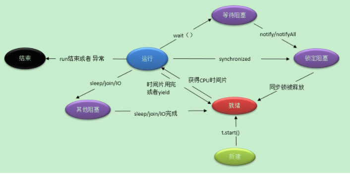

# JAVA-高级编程
以下是学习后的总结，[更具体的，参考这个学习网站，很好用](http://how2j.cn/stage/25.html)

**JAVA - 高级编程**

* <a href="#javaReflect">JAVA - 反射</a>
* <a href="#javaIO">JAVA - I/O</a>
* <a href="#javaThreat">JAVA - 多线程编程</a>
* <a href="#javaJVM">JAVA - 虚拟机</a>
* <a href="#javaGC">JAVA - 垃圾回收机制</a>
* <a href="#javaNet">JAVA - 网络编程</a>

### JAVA - 反射
<a name="javaReflect"></a>
有啥用：
使用反射方式，首先准备一个配置文件，就叫做 spring.txt 吧, 放在 src 目录下。 里面存放的是类的名称，和要调用的方法名。在测试类Test中，首先取出类名称和方法名，然后通过反射去调用这个方法。当需要从调用第一个业务方法，切换到调用第二个业务方法的时候，不需要修改一行代码，也不需要重新编译，只需要修改配置文件 spring.txt，再运行即可。
这也是 Spring 框架的最基本的原理，只是它做的更丰富，安全，健壮。

**获取类对象的三种方式**
1. Class.forName（“Hero”） 最常用，通过字符串获取
2. Hero.class  通过类来获取类，具体用在哪呢？
3. new Hero().getClass() 通过实例获取该类，也还可以。
Hero 是一个类，在一个JVM中，一种类，只会有一个类对象存在。所以以上三种方式取出来的类对象，都是一样的。反射其实就是获取类对象。反射指的是在运行时能够分析类的能力的程序。其中1，3会导致类的静态属性被初始化，而且只会执行一次，后面在调用不会初始化了，2不会。
```java
/*
知识点：getClass() ？
SubClass 和 SuperClass 的 getClass() 都没有重写，他们都是调用Object的getClass，而Object的getClass作用是返回的是运行时的类的名字。这个运行时的类就是当前类，所以下面的代码并不是获取父类的名字，而是当前类的名字。

*/
super.getClass().getName(); //当前类的名称
super.getClass().getSuperclass(); //真正获取父类的名称的方法

```


反射的特点：
1. 在运行时判断任意一个对象所属的类；在运行时构造任意一个类的对象；在运行时判断任意一个类所具有的成员变量和方法；在运行时调用任意一个对象的方法；生成动态。
2. 通过反射可以动态的实现一个接口，形成一个新的类，并可以用这个类创建对象，调用对象方法
3. 通过反射，可以突破Java语言提供的对象成员、类成员的保护机制，访问一般方式不能访问的成员
4. Java的反射机制会给内存带来额外的开销。例如对永生堆的要求比不通过反射要求的更多

问题：
1. Java反射主要涉及的类如Class, Method, Filed,等，他们都在java.lang.reflet包下？
答：在运行时分析类的能力--检查类的结构--所用到的就是 java.lang.reflect 包中的 Field、Method、Constructor，分别用于描述类的域、方法和构造器。Class类在java.lang中。

2. Java反射机制提供了字节码修改的技术，可以动态的修剪一个类？
答：不能修改。

3. Java反射机制一般会带来效率问题，效率问题主要发生在查找类的方法和字段对象，因此通过缓存需要反射类的字段和方法就能达到与之间调用类的方法和访问类的字段一样的效率？
答：不能，反射会降低效率，禁止安全检查，可以提高反射的运行速度。

手撕代码：
1、通过反射创建一个对象。
2、通过反射获取属性，再修改属性值
问：getField 和 getDeclaredField的区别？
答：这两个方法都是用于获取字段，getField 只能获取 public 的，包括从父类继承来的字段。
getDeclaredField 可以获取本类所有的字段，包括 private 的，但是不能获取继承来的字段。 (注： 这里只能获取到private的字段，不能访问该private字段的值,除非加上setAccessible(true))
3、通过反射调用一个对象方法

```java
 String className = "charactor.Hero"; //使用反射的方式创建对象
 Class pClass=Class.forName(className); //类对象
 Constructor c= pClass.getConstructor(); //构造器
 Hero h2= (Hero) c.newInstance(); //通过构造器实例化
 
 //获取类Hero的名字叫做name的字段
 Field f1= h.getClass().getDeclaredField("name");
 f1.set(h, "teemo");  //修改这个字段的值
 
 // 获取这个名字叫做setName，参数类型是String的方法
 Method m = h.getClass().getMethod("setName", String.class);
 m.invoke(h, "盖伦"); // 对h对象，调用这个方法

/*
错误：运用java反射机制获取实体方法报错，java.lang.NoSuchMethodException: int.<init>(java.lang.String)？
解决：构造Hero类时使用了基本数据类型，public int damage; 要换成包装类 Integer;
还有其他错误：如 xxx Hero<init>xxx?
解决：是找不到该类，因为我只写了类名，没有写包名.类名。
*/

```


### JAVA - I/O
<a name="javaIO"></a>
** I/O 文件对象**
**例题**：一般说来操作系统都会安装在C盘，所以会有一个 C:\WINDOWS目录。遍历这个目录下所有的文件(不用遍历子目录)，找出这些文件里，最大的和最小(非0)的那个文件，打印出他们的名。注: 最小的文件不能是 0 长度。
知识点：1如何创建文件对象，2返回文件夹下所有子文件的函数，3一个文件的长度
```java
import java.io.File; //引入必要的包
public class test{
	public static void main(String args[]){
		File fs = new File("C:/WINDOWS"); //创建一个文件对象
		long max=0, min=Integer.MAX_VALUE;
		File maxName=null, minName=null; //文件对象要初始化。
//该函数以文件数组的形式，返回当前文件夹下的所有文件（不包含子文件及子文件夹）
		for(File f : fs.listFiles()){ 
			if(f.length() > max){
				max = f.length();
				maxName = f;
			}
			if(f.length() < min && f.length() > 0){
				min = f.length();
				minName = f;
			}
		}
		System.out.println("最大的文件为： " + maxName + " 大小为：" + max);
		System.out.println("最小的文件为： " + minName + " 大小为：" + min);
		//输出文件名 maxName.getAbsoluteFile() 也可以。
	}
}
```

练习：对 d 盘的一个文件进行读取。
知识点：1文件输入输出流的创建，
```java
import java.io.File;
import java.io.FileInputStream;
import java.io.IOException;

public class test{
	public static void main(String[] args) {
		try{ //必须对其进行保护，否则会报错
		//File f = new File("F:/aa//bb//cc");
		//f.mkdir(); 防止文件路径不存在，可以创建递归目录。
			File f = new File("F:/test.txt");
			FileInputStream fis = new FileInputStream(f);
			byte[] all = new byte[(int)f.length()];
			fis.read(all);
			for(byte b : all){
				System.out.println(b); //输出asc码
			}
			fis.close(); //每次使用完需要关闭
		} catch(IOException e){
			e.printStackTrace();
		}
	}
}
```

**面试问题**
```java
//包括序列化、BIO、NIO、AIO


```


### JAVA - 多线程编程
<a name="javaThreat"></a>
**一、创建线程 和 线程常用方法**
创建多线程有 3 种方式，分别是 继承线程类，实现 Runnable 接口，匿名类。
1、继承线程类（需要重写 run 方法）：创建一个对象就是一个线程。
2、实现 Runnable 接口（需要重写 run 方法）：和上面相似，只是在实例化的时候有区别。
3、匿名类（不需要额外增加一个类）：和匿名函数相似，在用的时候才写，而且直接写在主函数里面。
注： 创建线程是start()方法，run()并不能创建一个新的线程


```java
Thread t1 = new Thread(){
	@Override
	public void run(){}//匿名函数修改 run 函数
}

/*
常用方法：
*/
t1.start(); //启动线程是start()方法，run()并不能启动一个新的线程
Thread.sleep(1000); //线程阻塞 1 秒
t1.join();
//在主线程中加入该线程，一般是 main 嘛，当 t1 执行完后，才会继续执行主函数
t1.yield(); //临时暂停，回到就绪状态，让位给同等优先级的其他线程。
t1.setPriority(Thread.MAX_PRIORITY);
//为线程 t1 设置优先级，优先级越高，有越大的几率获得 CPU 资源。
t1.setDaemon(true); //如果一个进程只剩下守护线程，则该进程会自动结束。守护线程通常会被用来做日志，性能统计等工作。

/*问：多线程问题
多线程问题：sleep、wait、yield、join、volatile、并发、线程池、锁的实现

Thread.sleep(100);
作用：让当前正在运行的占用 cpu 的线程，阻塞 100 ms，其余线程自己竞争获取 cpu，如果被停止，会抛出 InterruptedException，需要的注意的是就算线程的睡眠时间到了，他也不是立即会被运行，只是从阻塞状态变为了就绪状态，是不会由阻塞状态直接变为运行状态的。

this.wait()
自动释放对象锁，挂起，等待this.notify()唤醒，进入就绪状态。注意 wait和notify 两个方法都属于Object类，不是Thread线程上的，

**比较：sleep 方法 和 wait 方法**
对于sleep()方法，我们首先要知道该方法是属于Thread类中的，而wait()方法，则是属于Object类中的。sleep()方法导致了程序暂停执行指定的时间，让出cpu给其他线程，但是他的监控状态依然保持着，当指定的时间到了又会自动恢复运行状态。
在调用sleep()方法的过程中，线程不会释放对象锁。而当调用wait()方法的时候，线程会放弃对象锁，进入等待此对象的等待锁定池，只有针对此对象调用notify()方法后本线程才进入对象锁定池准备获取对象锁进入运行状态。

Thread.yield();
作用：暂停当前正在执行的线程对象，并执行其他线程，其实也不一定执行其他线程。yield()应该做的是让当前运行线程回到就绪状态，以允许具有相同优先级的其他线程获得运行机会。因此，使用yield()的目的是让相同优先级的线程之间能适当的轮转执行。但是，实际中无法保证yield()达到让步目的，因为让步的线程还有可能被线程调度程序再次选中。

t1.Join()
把线程t1加入到当前线程，最主要的功能其实是防止主线程执行结束了，子线程还在没执行完成。如果加入这一句，则一定等到t1执行完成后才继续往后（主线程中）执行。如果前面有多个线程在执行了，则也会加入到执行队伍中（顺序不定），并且也是只有到t1结束后，程序才会继续往后执行。

**问：关于 volatile 的一些面试问题**
参考博客1：https://blog.csdn.net/u011277123/article/details/72235927
参考博客2：https://blog.csdn.net/u012723673/article/details/80682208

问：volatile关键字的作用？
答：使得一个非原子操作变成原子操作，多线程访问中用 volatile 修饰 long和double 类型的变量。
解释：一个典型的例子是在类中有一个 long 类型的成员变量。如果你知道该成员变量会被多个线程访问，如计数器、价格等，你最好是将其设置为 volatile。为什么？因为 Java 中读取 long 类型变量不是原子的，需要分成两步，如果一个线程正在修改该 long 变量的值，另一个线程可能只能看到该值的一半（前 32 位）。但是对一个 volatile 型的 long 或 double 变量的读写是原子。

问：volatile原理？
volatile 是一种简单的同步的处理机制，被 volatile 修饰的变量遵循以下规则：
变量的值在使用之前总会从主内存中再读取出来。
对变量值的修改总会在完成之后写回到主内存中。

问：Java 中能创建 volatile 数组吗？修饰一个数组能否保证内存可见性？
能，Java 中可以创建 volatile 类型数组，不过只是一个指向数组的引用，而不是整个数组。如果改变引用指向的数组，将会受到 volatile 的保护，但是如果多个线程同时改变数组的元素，volatile 标示符就不能起到之前的保护作用了。

问：1、 HashMap和Hashtable的区别   
2、StringBuffer和StringBuilder的区别   
3、ArrayList和Vector的区别   
4、把非线程安全的集合转换为线程安全   
答：https://how2j.cn/k/thread/thread-thread-safe/703.html

问：ConcurrentHashMap如何保证线程安全？


*/

```

**二、线程同步问题**
问题：多个线程同时修改一个数据的时候，可能导致问题。

1. 线程同步的关键字
2. 同步主线程和子线程的三种方法
2.1 构造一个 object 对象，独占此对象才可执行该线程。
2.2 将此对象设定为 类的实例，则独占此实例才可调用此实例的方法（被关键字 synchronized  修饰过的多个方法，只有独占此实例，才可调用其中的任意一个）。
2.3 如果在类方法前（静态方法），加上修饰符 synchronized，同步对象是这个类的反射（即这个类独占，才可以调用 被关键字 synchronized  修饰过的多个方法中的一个）。一般是在方法前加 关键字，类前面是不加的。
3. 线程交互-生产者消费者模型。
```java
/*
1. 定义一个全局 object，谁占用谁有话语权
2. 可以用实例代替 object
3. 用关键字 synchronized 修饰方法
*/

Object someObject =new Object();
synchronized (someObject){}//此处的代码只有占有了someObject后才可以执行

Hero gareen = new Hero();
synchronized (gareen){}

public void hurt()
	synchronized(this){ //this 就代表了这个实例
		hp = hp - 1;
	}

public synchronized void hurt()//效果相同
	hp = hp - 1;
public static synchronized void method(){}//防止多个线程同时访问这个类中的synchronized方法。也就是说此种修饰，可以对此类的所有对象实例起作用。

/*
线程交互 wait() 和 notify()
这里需要强调的是，wait方法和notify方法，并不是Thread线程上的方法，它们是Object上的方法。 因为所有的Object都可以被用来作为同步对象，所以准确的讲，wait和notify是同步对象上的方法。wait()的意思是： 让占用了这个同步对象的线程，临时释放当前的占用，并且等待。 所以调用wait是有前提条件的，一定是在synchronized块里，否则就会出错。
*/
    public synchronized void recover() {
    	hp += 1;
    	System.out.printf("%s 血量增加到 %.0f \n", name, hp);
    	this.notify();
    }
    
    public synchronized void hurt() {
    	if(hp == 1) {
    		try {
    			this.wait();
    		}catch(InterruptedException e) {
    			e.printStackTrace();
    		}
    	}
    	hp -= 1;
    	System.out.printf("%s 血量减少为 %.0f \n", name, hp);	
    }

/*
问：可以用线程实现生产者消费者模型么？

问：lock 和 synchronized 的区别？ 
答：与  synchronized (someObject)  类似的 lock() 方法，表示当前线程占用 lock 对象，一旦占用，其他线程就不能占用了。与 synchronized 不同的是，一旦 synchronized 块结束，就会自动释放对 someObject 的占用。 lock却必须调用 unlock 方法进行手动释放，为了保证释放的执行，往往会把 unlock() 放在 finally 中进行。

synchronized:
1、一个对象有多个synchronized方法，只要一个线程访问了其中的一个synchronized方法，其它线程不能同时访问这个对象中任何一个synchronized方法。
2、在对象方法前，加上修饰符 synchronized ，同步对象是当前实例。
3、在类方法（静态方法）前，加上修饰符 synchronized，同步对象是这个类。

问：synchronized 底层实现，如何实现 Lock？
堆中实例对象的对象头中的重量级锁指针，因为这个锁对象存放在对象本身，也就是为什么Java中任意对象可以作为锁的原因。
参考博客：https://baijiahao.baidu.com/s?id=1612142459503895416&wfr=spider&for=pc


问：一个线程运行结束后不会立马销毁么？会发生什么？
答：结束后等待系统回收资源，线程池内的线程资源应该暂时不会回收。

问：两线程对变量i进行加1操作，结果如何？为什么？怎么解决？


*/
```

**三、 java 线程池**
问：如果一个线程出现异常，那么这个线程会被如何处理？
参考：https://blog.csdn.net/u011635492/article/details/80328815
未理解？？

问：java 实现多个子线程执行完毕后，再执行主线程
知识点：join 和 countDownLatch 进行阻塞

```java
//下面的代码没有实现此功能哦，主线程会先结束，子线程还未执行完毕。
//以下两种做法的区别，参考：https://blog.csdn.net/zhang199416/article/details/70846958
/*
1 final CountDownLatch latch = new CountDownLatch(3); 需要阻塞的线程数量
子线程中添加：latch.countDown();

2 子线程.join();
*/
public class test {
	public static void main(String[] args) {
		System.out.println("主线程开始执行....");
		for (int i = 0; i < 3; i++) {
			new Thread(){
				@Override
				public void run() {
					try {
						System.out.println(Thread.currentThread().getName()+"  开始执行存储过程..");						
						Thread.sleep(1000);
						System.out.println(Thread.currentThread().getName()+"  存储过程执行完毕...");						
					} catch (InterruptedException e) {
						e.printStackTrace();
					}
				};
			}.start();
		}
		System.out.println("主线程执行完毕....");
	}
}

```

### JAVA - 虚拟机
<a name="javaJVM"></a>
JAVA虚拟机简介
参考链接：https://blog.csdn.net/qq_41701956/article/details/81664921

JDK各个版本发布时间和版本名称
参考链接：https://blog.csdn.net/J080624/article/details/85259041

JDK1.5，1.6，1.7，1.8，1.9，1.10，1.11的新特性整理
参考链接：https://blog.csdn.net/J080624/article/details/85092655

```java
/*1.程序计数器是一个比较小的内存区域，用于指示当前线程所执行的字节码执行到了第几行，是线程隔离的.
2.虚拟机栈描述的是Java方法执行的内存模型，用于存储局部变量，操作数栈，动态链接，方法出口等信息，是线程隔离的
3.方法区用于存储JVM加载的类信息、常量、静态变量、以及编译器编译后的代码等数据，是线程之间贡献的
4.原则上讲，所有的对象都在堆区上分配内存，是线程之间共享的
*/
```


### JAVA - 垃圾回收机制
<a name="javaGC"></a>

```java

```


### 网络编程
<a name="javaNet"></a>
[参考W3C 网络编程](https://www.w3cschool.cn/java/java-networking.html)
能够实现：如何创建服务器套接字、如何创建客户端套接字、
知识点：获取本机 IP 地址，使用 Java 执行 ping 命令，

```java
/*
练习：实现查看本网段哪些 IP 地址已被占用，单线程超级慢，要十几分钟。
进阶：可考虑使用多线程实现。
*/
import java.io.BufferedReader;
import java.io.InputStreamReader;
import java.io.IOException;
public class test{
	public static void main(String[] args) throws IOException{
	//可执行 exe 程序
		Process p = Runtime.getRuntime().exec("ping " + "www.baidu.com");
	//获取 流 到缓存中
		BufferedReader br = new BufferedReader(new InputStreamReader(p.getInputStream()));
		StringBuilder sb = new StringBuilder();
		String line = null;
		while((line = br.readLine()) != null){
			if(line.length() != 0)
				sb.append(line + "\r\n");
		}
		System.out.println(sb.toString());
	}
}

```

实例：编写客户端和服务器端双向通信，多线程实现。
```java
// 客户端代码
import java.io.DataInputStream;
import java.io.DataOutputStream;
import java.io.IOException;
import java.io.InputStream;
import java.io.OutputStream;
import java.net.Socket;
import java.net.UnknownHostException;
import java.util.Scanner;
 
public class ClientThread {
 
    public static void main(String[] args) {
        // TODO Auto-generated method stub
        try{
            Socket socket = new Socket("127.0.0.1",9612);
            SendServer(socket);
            ReceiveServer(socket);
             
        } catch (UnknownHostException e) {
            // TODO Auto-generated catch block
            e.printStackTrace();
        } catch (IOException e) {
            // TODO Auto-generated catch block
            e.printStackTrace();
        }
    }
 
    private static void SendServer(Socket socket) {
        new Thread() {
 
            @Override
            public void run() {
                //synchronized (socket) {
                    try (OutputStream os = socket.getOutputStream();
                            DataOutputStream dos = new DataOutputStream(os);
                            Scanner scann = new Scanner(System.in);) {
                        while (true) {
                            String msg = scann.nextLine();
                            dos.writeUTF(msg);
                        }
 
                    } catch (IOException e) {
                        // TODO Auto-generated catch block
                        e.printStackTrace();
                    }
                }
            //}
             
        }.start();
    }
 
    private static void ReceiveServer(Socket socket) {
        new Thread() {
 
            @Override
            public void run() {
                synchronized (socket) {
                    try (InputStream ins = socket.getInputStream(); DataInputStream dins = new DataInputStream(ins);) {
                        while (true) {
                            //System.out.println("从服务器收到的信息：");
                            String msg = dins.readUTF();
                            System.out.println("从服务器收到的信息："+msg);
                        }
 
                    } catch (IOException e) {
                        // TODO Auto-generated catch block
                        e.printStackTrace();
                    }
                }
            }
             
        }.start();
    }
 
}
 
// 服务端代码
import java.io.DataInputStream;
import java.io.DataOutputStream;
import java.io.IOException;
import java.io.InputStream;
import java.io.OutputStream;
import java.net.ServerSocket;
import java.net.Socket;
import java.util.Scanner;
 
public class ServerThread {
 
    public static void main(String[] args) {
        System.out.println("运行中……");
        try{
            ServerSocket serversocket = new ServerSocket(9612);
            System.out.println("服务器等待连接");
            Socket socket = serversocket.accept();
            // 设置服务器监听的端口
            ReceiveClient(socket);
            SendClient(socket);
        } catch (IOException e) {
            e.printStackTrace();
        }
    }
 
    private static void ReceiveClient(Socket socket) {
        new Thread() {
 
            @Override
            public void run() {
                try (
                        InputStream ins = socket.getInputStream();
                        DataInputStream dins = new DataInputStream(ins);
                ){
                    while (true) {
                        String msg = dins.readUTF();
                        System.out.println("接受客户端的信息："+msg);
                    }
                } catch (IOException e) {
                    // TODO Auto-generated catch block
                    e.printStackTrace();
                }
            }
             
        }.start();
    }
 
    private static void SendClient(Socket socket) {
        new Thread() {
 
            @Override
            public void run() {
                //synchronized (socket) {
                    try (OutputStream os = socket.getOutputStream();
                            DataOutputStream dos = new DataOutputStream(os);
                            Scanner scann = new Scanner(System.in);) {
                        while (true) {
                            String msg = scann.nextLine();
                            dos.writeUTF(msg);
                        }
 
                    } catch (IOException e) {
                        // TODO Auto-generated catch block
                        e.printStackTrace();
                    }
                //}
            }
             
        }.start();
    } 
}
```


