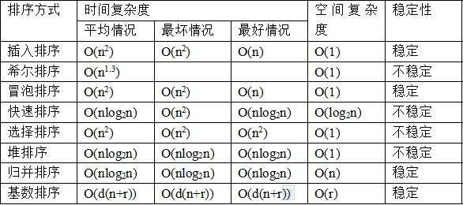

# Java-排序算法

1. 插入类排序：<a href="#简单插入排序">简单插入排序</a>，升级为-<a href="#希尔排序">希尔排序</a>
2. 选择类排序：<a href="#简单选择排序">简单选择排序</a>，升级为-<a href="#堆排序">堆排序</a>
3. 交换类排序：<a href="#冒泡排序">冒泡排序</a>，升级为-<a href="#快速排序">快速排序</a>
4. <a href="#归并排序">归并排序</a>、<a href="#计数排序">计数排序</a>
5. <a href="#乱数排序">乱数排序</a>
6. <a href="#三色旗">三色旗</a>
7. <a href="#摆动排序">摆动排序</a>
8. <a href="#煎饼排序">煎饼排序</a>
9. <a href="#距离相等的条形码">距离相等的条形码</a>
10. <a href="#距离顺序排列矩阵单元格">距离顺序排列矩阵单元格</a>

快捷键：Ctrl + Home 快速回到页面顶端查看目录，点击锚点，快速定位到算法。




```java
//java函数的使用


```


**以下先介绍三种简单排序：冒泡排序、选择排序、插入排序。**

<a name="冒泡排序"></a>

```java
/*冒泡排序
选择理由：稳定，与原位置偏离不远。
基本思想：第一个 for 循环定义比较的趟数 n-1 趟，第二个进行比较，定义比较的边界，默认有增加一个状态判断，如果某趟没有进行过交换，则直接结束。
时间复杂度：最好O(n)，最差O(n2), 平均O(n2)
空间复杂度：O(1)
*/
public static void bobleSort(int[] array){
    int length = array.length-1;
    boolean state;
    for(int i=0; i<length; i++){
        state = false;
        for(int j=0; j<length-i; j++){
            if(array[j] > array[j+1]){
                int temp = array[j];
                array[j] = array[j+1];
                array[j+1] = temp;
                state = true;
            }
        }
        if(!state)
            return;
    }
}
```

<a name="简单插入排序"></a>

```java
/**
*简单插入排序
选择理由：稳定，基本有序。
基本思想:从第一个元素开始，不断整理顺序。
时间复杂度：最好O(n)，最差O(n2),平均O(n2)
空间复杂度：O(1)
*/
public static void insertSort(int[] array){
    int length = array.length;
    for(int i=1; i<length; i++){//定义待排序的数
        int temp = array[i];
        int j = i;
        while(j-1>=0 && temp<array[j-1]){
            array[j] = array[j-1];
            j--;
        }
        array[j] = temp;
    }
}
```

<a name="简单选择排序"></a>

```java
/**
*简单选择排序
选择理由：不稳定，很无序，与原位置偏离较远。
基本思想:后面找到最小的值后再来交换，比冒泡排序的优点是不用交换那么多次[可能也是唯一的优点吧]。
时间复杂度：无论好差平均都是O(n2)
空间复杂度：O(1)
*/
public static void selectSort(int[] array){
    int length = array.length-1;
    for(int i=0; i<length; i++){//定义待交换的数
        int minindex = i;
        for(int j=i+1; j<=length; j++){
            if(array[j] < array[minindex])
                minindex = j;
        }
        if(minindex != i){
            int temp = array[i];
            array[i] = array[minindex];
            array[minindex] = temp;
        }
    }
}
```

**前面三种最差都是O(n2)，经过后人的不断努力，研究，速度才得以提升。排序要加快的基本原则之一，是让后一次的排序进行时，尽量利用前一次排序后的结果，以加快排序的速度。以下介绍几种进阶排序：希尔排序、堆排序、归并排序、快速排序、计数排序**

<a name="希尔排序"></a>

```java
/**
希尔排序-缩小增量排序
选择理由：不稳定，适合基本无序的序列，内部使用了简单插入排序。
基本思想:当增量为 1 时，其实就是插入排序。我们比较的元素可以再远一点，即所谓的增量，等距的一些元素先排序，再逐渐过渡到整个数组，最后的增量肯定是 1，检查还有哪些没有排好序。
时间复杂度：最差O(n2)，最好平均不确定(增量的选择很关键，有很多研究)
空间复杂度：O(1)
*/
public static void shellInsert(int[]array, int d){
    int length = array.length-1;
    for(int i=d; i<=length; i++){
        int temp = array[i];
        int j = i;
        while(j-d >= 0 && temp < array[j-d]){
            array[j] = array[j-d];
            j -= d;
        }
        array[j] = temp;
    }
}

public static void shellSort(int[]array){
    int length = array.length-1;
    int d = length/2;
    while(d >= 1){
        shellInsert(array,d);
        d /= 2;
    }
}
```

<a name="堆排序"></a>

```java
/*堆排序
选择理由：简单选择排序没有很好利用第一次比较的结果，因此改进为堆排序,不稳定。
基本思想:建堆：从最后一个非叶子节点开始调整到根节点；
大顶堆：将最大值移动到根节点，父节点：一定比所有的子节点都大
小顶堆：将最小值移动到根节点，父节点：一定比所有的子节点都小
排序：从根节点取出数放在最后面n-1次。这里并不直接使用数，而是用数组模拟树结构，数组到树的转换，下标从 0 开始，节点若存在父节点则下标为 n//2，若有子节点则左子节点下标为 2*n+1，右子节点下标为 2*n+2.

时间复杂度：最好-最差-平均都是：O(nlogn)这就很厉害了！
空间复杂度：O(1)

堆排序经典应用：
1. 三角形的最大周长：给定一个长度数组，返回三条构成三角形的最大周长。
解题思路：不一定要将数组全部排序，构造大顶堆，边排序边判断两边之和大于第三边即可。
*/
public static void heapadjust(int[]array, int root, int end){
    int leaf = root*2+1;
    int temp = array[root];
    while(leaf <= end){
        //比较两个子节点
        if(leaf < end  && array[leaf+1] > array[leaf])
            leaf += 1;
        // 迭代后不是和父节点比较，因为我没有交换，和保存父节点值的tmp比较
        if(array[leaf] > temp){
            array[root] = array[leaf];//# 将父节点替换成新的子节点的值，这里就完成了转换
            root = leaf;//赋坐标，为下一步迭代做好准备，子节点变成父节点
            leaf = root*2+1;//寻找子节点的子节点
        }else
            break;
        array[root] = temp; //将转换的值赋给最终移动到的地方。
    }
}

public static void heapSort(int[]array){
    int length = array.length;
    // 创建堆，和下面排序不同的是，我们转换的范围永远是整个数组n-1
    for(int not_leaf=length/2-1; not_leaf>=0; not_leaf--)
        heapadjust(array, not_leaf, length-1);
    // 挨个出数，创建堆已经完成了第一次排序
    for(int end=length-1; end>=0; end--){
        int temp = array[end];
        array[end] = array[0];
        array[0] = temp;
        heapadjust(array, 0, end-1);
    }
}
```

<a name="归并排序"></a>

```java
/**
*归并排序-分治递归的思想,代码为二路归并
选择理由：稳定，一般用于总体无序，但各子项相对有序。

基本思想:将列表分成 n 部分，再两两合并，注意和快速排序的区分。
时间复杂度：最好-最差-平均都是：O(nlogn)这就很厉害了！
空间复杂度：O(n)

归并排序经典应用：
1. 排序链表：
解题思路:递归归并
经典考察三个知识点：归并排序，找中间节点，合并链表
2.剑指offer-计算数组的逆序对
*/
package test;
import java.util.ArrayList;
public class test {
	//合并左右子序列函数
    public static void merge(int[] arr, int left, int mid, int right) {
        int l = left, r = mid+1;//左右段子序列起始
        ArrayList<Integer> temp = new ArrayList<>();//中间数组
        while(l <= mid && r <= right){
            if(arr[l] <= arr[r]){//要加等号，否则不稳定。
                temp.add(arr[l]);
                l++;
            }
            else{
                temp.add(arr[r]);
                r++;
            }
        }
        while(l <= mid){
            temp.add(arr[l]);
            l++;
        }
        while(r <= right){
            temp.add(arr[r]);
            r++;
        }//!注意这里，不能直接li=temp,他俩大小都不一定一样
        for(int i=0; i<temp.size(); i++)
            arr[i+left] = temp.get(i);
    }
    //#递归调用归并排序
    public static void msort(int[] array, int left, int right) {
    	if(left < right){
            int mid = (left+right)/2;
            msort(array,left,mid);
            msort(array,mid+1,right);
            merge(array,left,mid,right);
        }
    }
    
    public static void main(String[] args) {
        int[] arr = {3,7,4,6};
        int length = arr.length;
        if(length > 0){
            msort(arr,0,length-1);
            for(int x : arr)
                System.out.println(x);
        }
    }
}

/**
*2.剑指offer-计算数组的逆序对
主要修改合并函数，倒序合并统计，注意如果对1000000007取模，则每次循环都要取模。
*/
int l = mid, r = right;//左右段子序列起始
ArrayList<Integer> temp = new ArrayList<>();//中间数组
while(l >= left && r > mid){
    if(arr[l] <= arr[r]){//要加等号，否则不稳定。
        temp.add(arr[r]);
        r--;
    }
    else{
        temp.add(arr[l]);
        l--;
        nums = nums + r - mid;
    }
}

```

<a name="快速排序"></a>

```java
/*
*快速排序-20世纪十大算法之一，别问我其他九大算法。
选择理由：不稳定，但是后序研究丰富，很多优化方案。进行优化后，该排序算法依旧很强！
优化1：三数取中，即不再将最左边的值当做中间枢纽。而是取左中右三个值。
优化2：对于大数据是效果较好，但是如果数据本身就很小，反而更费事了，因此采用分区大小调整，当数据集
较小时，不必继续递归调用快速排序算法，而改为调用其他的对于小规模数据集处理能力较强的排序算法来完成。
一般使用插入排序，因为当区间较小时，已经几乎完成排序，有着接近线性的复杂度
优化4：数据较小更换排序算法

基本思想:选一个数作为中间枢纽，进行列表的划分，递归。
时间复杂度：最差O(n2)，最好O(nlogn)，平均O(nlogn) -由分区的好坏决定。
空间复杂度：O(n)，主要为递归造成的空间栈的使用
*/
public static int partition(int[] array, int left, int right) {
    int key = left;
    while(left < right){
        while(left < right && array[right] >= array[key])
            right--;
        while (left < right && array[left] <= array[key]) 
            left++;
        int temp = array[left];
        array[left] = array[right];
        array[right] = temp;
    }
    int temp = array[left];
    array[left] = array[key];
    array[key] = temp;
    return left;
}
public static void quickSort(int[] array, int left, int right) {
    if(left >= right)
        return;
    int mid = partition(array, left, right);
    quickSort(array, left, mid-1);
    quickSort(array, mid+1, right);
}
public static void main(String[] args) {
    int[] array = {1,9,2,8,3,7};
    int length = array.length - 1;
    if(length <= 0)
        return;
    quickSort(array, 0, length);
    for(int x : array)
        System.out.println(x);
}

```

<a name="计数排序"></a>

```java
/*
*计数排序-牺牲空间复杂度来使时间复杂度达到线性增长，唯一不使用比较的排序算法。
时间复杂度为 O(n) 有点意思哦！
空间复杂度为 O(n)

对于小规模排序计数排序的时间复杂度和空间复杂度都是效率较高的，但是计数排序对输入有限制，并不是所有情况下都能使用这种排序算法。计数排序的一个大前提就是序列中的每个数字都必须为0到k的整数。

计数排序经典应用：
1. 最大间距
应用：给500万考生成绩排序，超级快，适用于元素集合不大的情况，分数最多是0-1000。
应用：在一个文件中有 10G 个整数，乱序排列，要求找出中位数，内存限制为 2G，只写出思路即可。
*/
public static int[] countAlgorithm(int[] orgArray, int maxNum) {
    int[] tempArray = new int[maxNum+1];
    int[] sortedArray = new int[orgArray.length];
    // 统计原始列表中不同数字的个数，以数字为下标，在新列表中统计
    for(int x : orgArray)
        tempArray[x]++;
    //#统计小于当前坐标的数字有多少个,迭代方式
    for(int i=1; i<= maxNum; i++)
        tempArray[i] += tempArray[i-1];
    //#找到某个数的个数减一，就是他在新列表的坐标。
    //#如果要让它是稳定的，需要逆序输出
    for(int i=orgArray.length-1; i>=0; i--){
        tempArray[orgArray[i]]--;
        sortedArray[tempArray[orgArray[i]]] = orgArray[i];
    }
    return sortedArray;
}
```


### 下面是一些经典排序的算法

  <a name="乱数排序"></a>

```java
/*洗扑克牌-乱数排序
思路：如何有效打乱一个数组：遍历数组的位置，然后产生随机数，将随机数位置与当前位置交换即可。
输入：poker = [1,...,52]
*/
public static void washPoker(int[] poker) {
	int length = poker.length;
	for(int i=0; i<length; i++) {
		int randomInd = (int)(Math.random()*length);//注意这里是两个括号！！
		int temp = poker[i];
		poker[i] = poker[randomInd];
		poker[randomInd] = temp;			
	}
}
```

  <a name="三色旗"></a>

```java
/*三色旗排序法
题目概述：将蓝白红三种旗子，按照顺序排好，要求移动次数最少，一次只能调换两个旗子。
解题思路：设置三个指针，左边两个，右边一个，blue = white = 0，red = len-1,然后从左往右判断，如果旗子颜色是，白色：w++，蓝色： swap(b++,w++)，红色： r 向左移动到非红色，再 swap(w,r)
*/
public static void triColor(char[] flags) {
	int b = 0, w = 0, r = flags.length-1;
	while(w <= r) {
		if(flags[w] == 'w')
			w++;
		else if(flags[w] == 'b') {
			flags[w] = flags[b];
			flags[b] = 'b';
			w++;
			b++;
		}else {
			while(r > w && flags[r] == 'r')
				r--;
			flags[w] = flags[r];
			flags[r] = 'r';
			r--;
		}
	}
}
```

  <a name="摆动排序"></a>

```java
/**
*摆动排序
题目概述：将数组排序成a <= b >= c <= d >= e......
解题思路1: 复杂度O(nlogn)，先排序，再调换二三，四五，...等的位置
half = (len(nums)+1)//2
nums.sort()
nums[::2],nums[1::2] = nums[:half][::-1],nums[half:][::-1]

解题思路2: 复杂度O(n)，分析可知，当i为奇数时，nums[i] >= nums[i - 1]
当i为偶数时，nums[i] <= nums[i - 1]
*/
public static void swingSort(int[] nums) {
	Arrays.parallelSort(nums);
	int length = nums.length;
	if(length <=2 )
		return;
	for(int i=2; i<length; i+=2) {
		int temp = nums[i];
		nums[i] = nums[i-1];
		nums[i-1] = temp;
	}
}
```

  <a name="煎饼排序"></a>

```java
/**
*煎饼排序
题目概述：给定数组 A=[1,...,n] 不重复打乱顺序的连续值，我们可以对其进行煎饼翻转：我们选择一些正整数 k <= A.length，然后反转 A 的前 k 个元素的顺序。我们要执行零次或多次煎饼翻转（按顺序一次接一次地进行）以完成对数组 A 的排序。返回能使 A 排序的煎饼翻转操作所对应的 k 值序列。任何将数组排序且翻转次数在 10 * A.length 范围内的有效答案都将被判断为正确。来源：力扣（LeetCode）
解题思路:倒序排，将 A 中的元素从大到小依次反转到数组的尾部。
*/

public static ArrayList<Integer> pancakeSort(int[] nums) {
	int tail = nums.length;
	ArrayList<Integer> res = new ArrayList<>();
	while(tail > 1) {
		int index = indexNum(nums, tail);//自己实现寻找 tail 的下标
		if(index != 0) {
			nreverse(nums, index);//自己实现倒转 [0,index]
			res.add(index+1);
		}
		nreverse(nums,tail-1);
		res.add(tail);
		tail -= 1;
	}
	return res;
}
```


