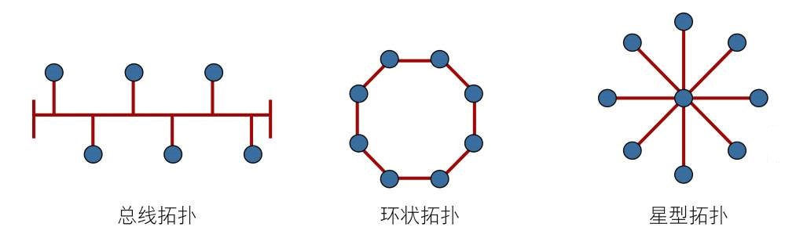
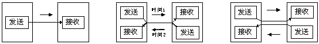

# 三、数据链路层（MAC层）

* **传输单位**：帧

* **功能**：链路的连接建立、分离；帧定界和帧同步；差错检测；

* **协议**：CSMA/CD（载波帧听多路访问/冲突检测）协议；PPP；HDLC

****

* **问：差错检测？**

* **答**：使用循环冗余码检验差错检测技术，只能做到对帧的无差错接受，即我同意收入怀中的肯定是好货，那些坏的我都丢了，你自己看着办吧，所以要依靠传输层的 TCP可靠传输来检验了。有人问为啥不在这一层就做了呢，其实吧现在电缆质量高，基本传输都能到，如果增加了完整性验证，那么肯定会拖慢速度，得不偿失，99% 到就可以了，你不知道追求剩下的1%可能要花上好几倍的代价么。

  ****

* **问：以太网（Ethernet）？**

* **答**：IEEE802.3 可以等同于以太网标准，以太网 采用总线拓扑结构，所有计算机都共享一条总线，信息以广播方式发送。为了保证数据通信的可靠性，使用了 CSMA/CD 技术对总线进行访问控制。考虑到局域网信道质量好，所以稍微改进了下，增加传输速度，1. 采用无连接的工作方式； 2. 不对发送的数据帧进行编号，也不要求对方发送确认帧。就是我尽量给你发，差错纠正由传输层的 TCP 完成。

  **高速以太网（100BASE-T、1000BASE-T）**：传输速率大于等于 100Mbit/s，允许 10Mbit/s 网卡共存，标准定义的 MII 将 MAC 子层与物理层分隔开。为了最大程度的减少冲突，最大程度的提高网络速度和使用效率，使用交换机（Switch）来进行网络连接和组织，这样，以太网的拓扑结构就成了星型，但在逻辑上，以太网仍然使用总线型拓扑和 CSMA/CD(Carrier Sense Multiple Access/Collision Derect 即带冲突检测的载波监听多路访问) 的总线争用技术。

  ****

* **问：有人说数据链路层不提供重传机制，为什么以太网会有重传机制？**

* **答**：以太网是不可靠的，根据上面的介绍，它不知道对方有没有收到，但是如果知道自己发错了（CSMA/CD协议，有冲突时要停止发送，发了一半，下次你不给别人重发？）以太网重传是 微秒级 的，传输层是 毫秒级 的，应用层是 秒级 的，所以越底层的重传速度越快，所以可以的话，以太网也要具有重传机制。否则将花费更多代价。

  ****

* **问：计算机内的传输是（）传输，通信线路上的传输是（）传输？**

* **答**：并行，串行。并行是指“并排行走”或“同时实行或实施”。在操作系统中是指，一组程序按独立异步的速度执行，无论从微观还是宏观，程序都是一起执行的。对比地，并发是指:在同一个时间段内，两个或多个程序执行，有时间上的重叠(宏观上是同时,微观上仍是顺序执行)。串行通信是指 使用一条数据线，将数据一位一位地依次传输，每一位数据占据一个固定的时间长度。

  ****

* **问：局域网？**

* **答**：是指一个较小范围内的多台计算机互连，以达到资源和信息共享，优点：具有广播功能。

  ****

* **问：按照因特网的观点，用网桥连接起来的若干局域网仍为一个局域网，因此这些局域网都具有相同的网络号，请问这句话的说法是正确的吗？**

* **答**：对的。
  **网桥**：两个或以上端口，可将两个不同物理层，不同 MAC 子层，不同速率的以太网连接起来，适用于用户数不多的情况。可过滤帧，将同一个网段的帧 **丢弃**，不予转发，可隔离冲突域。用网桥互连的网段仍然是一个局域网，只能有一个网络号，这里的分段理解为网桥左边的就是一个段，网桥右边的就是一个段，两个段必须具有相同的网络号，否则我也转发不了。那么问题来了，既然这样不如每台电脑都划分一个段，交换机来了。
  **工作方式**：网络 1 和网络 2 通过网桥连接后，网桥接收网络 1 发送的数据包，检查数据包中的地址，如果地址属于网络 1 ，它就将其放弃，相反，如果是网络 2 的地址，它就继续发送给网络 2。这样可利用网桥隔离信息，将同一个网络号划分成多个网段（属于同一个网络号），隔离出安全网段，防止其他网段内的用户非法访问。由于网络的分段，各网段相对独立（属于同一个网络号），一个网段的故障不会影响到另一个网段的运行。
  **交换机**：多端口网桥，每个端口都直接与主机或集线器相连接，并且一般工作在 **全双工** 状态。对于普通的 10 Mbit/s 的共享式网络，若有 N 个用户，则每个用户平均带宽为 1/N。以太网交换机独占传输媒体的带宽，因此对于拥有 N 个端口的全双工交换机的总容量为 2 * N * 10 Mbit/s，每个人都能感觉是 10 Mbit/s，是不是很厉害。生活中可以找一找，公司里面连接电脑都是用的交换机。

  **交换机隔离冲突域**：交换机根据所传递数据报的目的地址，将数据报独立从源端口发送到目的端口，避免了与其他端口的碰撞，每个端口属于一个冲突域。如果 MAC 地址不存在，那么交换机才广播到所有端口，接收端口会反馈会新的地址，然后保存。
  
  **交换机与网桥的异同**：1. 交换机端口更多，网桥一般只有两个端口。2. 网桥端口一般连接局域网网段，交换机一般直接与主机相连或者集线器（Hub）。3. 交换机可允许多对计算机同时通信，网桥只允许两个网段的一对计算机。
  
  ****

* **问：CSMA/CD 工作流程？**

* **答**：先听后发，边听边发，冲突停发，随机重发：即每个站发送数据前先检测总线是否有其他计算机在发送数据，有-不发，没有-发。发送的同时监听着，若有冲突-等待会重发。

* **问：不同网络结构的访问控制？**

* **答**：1. 星型拓扑结构 和 总线型网络 一般采用 CSMA/CD(载波监听多点接入/碰撞检测)

  2. 典型的环形网络有 Token-Ring（IBM的最有影响的令牌环网） 和 FDDI 等，环形网络常用的访问控制方法是基于令牌的访问控制，是一种分布式访问控制技术。令牌环局域网把多个设备安排成一个物理或逻辑环，让一个令牌沿着环依次传递，拿到令牌才能发送数据，所以不会发生冲突。

  3. 10BASE-T 采用的逻辑拓扑结构是（总线）方式。

     

  ****

* **问：有固定基础设施的无线局域网的MAC层不能使用 CSMA/CD 协议，而是使用CSMA/CA协议。**

* **答**：CSMA/CA协议：工作方式略有不同，比 CSMA/CD 协议可靠，也是先听后发，但在发送完一个帧后会等待一段时间，如果有确认帧返回，则发送下一帧，否则重传上一帧。

  ****

* **问：PPP 接收到一个错误的数据帧时，丢弃该帧并返回一个否认帧？**

* **答**：对的。ppp，数据链路层协议，采用全双工通信方式，是数据链路层的一种可靠协议，但因为它不处理差错，对传输错误的帧只是简单的丢弃并告诉对方，“你发错了”要求对方重发，对错误的处理交给上层。因此不是完全意义上的可靠。

  ****

* **问：HDLC？**

* **答**：在通信较差的年代，数据链路层使用可靠传输协议是比较好的选择，因此就有了我们的 HDLC 协议，会使用三类反馈帧来确保传输的可靠性，信息帧，监督帧，无编号帧。

  ****

* **问：HDLC 和 PPP 比较？**

* **答**：PPP 是面向字节的，HDLC 是面向比特的。现在通信质量很高，一般不会出现很多错误，所以不需要那么繁杂的保证可靠，快就完事了，因此 PPP 应用的较多。
  
  ****
  
* **问：单工、半双工、全双工？**

* **单工**：单工数据传输只支持数据在一个方向上传输，在同一时间只有一方能接受或发送信息，不能实现双向通信，举例：电视，广播。

  **半双工**：半双工数据传输允许数据在两个方向上传输，但是，在某一时刻，只允许数据在一个方向上传输，它实际上是一种切换方向的单工通信，举例：对讲机。

  **全双工**：全双工数据通信允许数据同时在两个方向上传输，因此，全双工通信是两个单工通信方式的结合，它要求发送设备和接收设备都有独立的接收和发送能力，在同一时间可以同时接受和发送信息，实现双向通信，举例：电话通信。

  
  
* **问：网卡是全双工的、计算机与打印机之间的通信属于？**
  
* **答**：单工，是不是有点奇怪，不是有反馈么？打印机是输出设备，电脑会依据要打印的内容使打印机工作，如果打印机没有完成指令，卡纸、没墨及一些常见问题，电脑系统 会检查输出设备的工作情况，并作出提示。类似的还有 遥控 等。