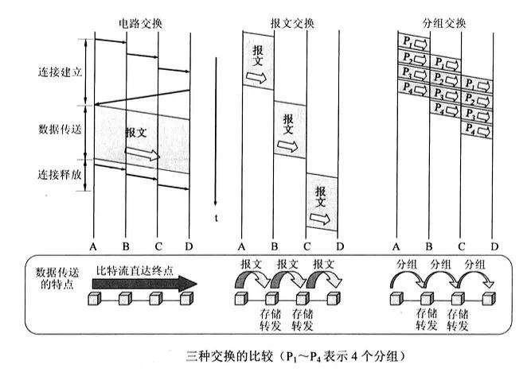

# 四、网络层
* **传输单位**：分组，（数据报）见下面详解

* **功能**：组包[传输分组用]、拆包[接收分组用]、路由选择、分组转发

* **协议**：IP、CIDR、NAT；IP相关的三个协议：ARP、DHCP、ICMP；三种常用路由选择协议：RIP、OSPF、BGP

  ****
  
* **问：路由器（Router）的功能？**

* **答**：功能包括：路由选择，分组转发。当中继系统是集线器或交换机时，一般不称为网络互连，这仅仅是把网络扩大了，扔然是一个网络，互联网都是指路由器进行互连的网络，路由器总是具有两个或两个以上的 IP 地址。

  ****
  
* **问：转发 和 路由选择 是同一概念，都是指当交换结点收到分组后，根据其目的地址查找转发表，将该分组发送出去？**

*  **答**：错误。转发 发生在 路由器 上，分组到达 路由器 后，由 路由器 检查分组地址并将它转发到一个邻接的局域网( LAN )上。路由选择 是指 通过互连网络从 源节点 到 目的节点 传输信息的路线，包括多个路由器的选择，在确定最佳路径的过程中，路由选择算法需要初始化和维护路由选择表（routingtable）。路由选择表中包含的路由选择信息根据路由选择算法的不同而不同。

  ****
  
* **问：路由选择（RIP、OSPF、BGP）？**

* **答**：网络错综复杂，选择好的路由还是很关键的，有两大类，静态路由选择 和 动态路由选择，我们从字面上看也知道，静态路由选择简单开销小，但不能适应网络状态变化，适合很小的网络，手动配置路由；那我们更多的使用肯定是动态路由，动态调整听起来就很厉害，因此它主要分为两种基本类型 距离-向量路由算法（RIP） 和 链路状态路由算法（OSPF）。**RIP**：简单点说就是经过的路由器越少，那么我就推荐这条路线给你用。**OSPF**：则是每个路由器都有一份世界地图，这样肯定好找，但是要经常更新此地图。OSPF 适合于在大型的互连网上使用，而 RIP 适合于在小型的互连网上使用。记住两个算法都是 **动态路由** 的算法。

* **BGP**：外部网关协议，是不同自治系统的路由器之间交换路由信息的协议。采用 路径-向量路由选择协议，寻找到一条到达的就很不错了，不是找一条最佳路由，因为规模实在太大，不现实。通过 TCP 连接与其他自治系统进行交流。

   **RIP：传输层 UDP 传送、OSPF：IP 数据报传送、BGP：TCP 连接传送**

   ****

* **问：电路交换？**

* **答**：此种方式在通信之前需要在通信的双方间建立成一条被双方独占的物理通道（显然工作在 **物理层**）。这个通道是由双方间的交换设备和链路逐段连接而建成的。优点肯定就是延迟小，实时性强，相当于为你一家拉了一条线，缺点就是利用率低，即使你不发送消息，我也不能用，就很麻烦了。
  
  ****
  
* **问：报文交换？**

* **答**：以【报文】为数据交换的单位（那么肯定工作在 **传输层**，只有传输层有报文嘛），报文中携带目标地址、源地址等信息，交换结点的过程中采用存储转发的传输方式。就是将整个报文存下来，然后再发往下一个节点。优点：肯定是改进上面的啦，不用独占信道，一个报文，随便走海路空，最终到达即可。 缺点很明显，对报文大小没有限制，网络节点可能需要很大的缓存空间。
  
  ****
  
* **问：分组交换？**

* **答**：1. 采用存储转发的方式，2. 在整个传送过程中，不需事先建立连接，3. 各分组携带必要的控制信息，比如分组号，网络节点为每个分组进行路由选择。优点：当然是去掉上一种方式的缺点喽，分组就是将原来大的报文拆分，加上序号、IP 地址等必要的信息，再存储转发，这样是不是就快很多了（**这里是不是也解释了 报文 和 分组 的区别了**）。
分组交换的方式有两种：一种是 **面向连接的虚电路** 和 **无连接的数据报**。是不是又有点绕了，前面介绍的都是以前的概念，电路交换肯定需要一条独占的物理通道，报文交换肯定是随意转发不用固定线路的，那么分组交换就是集各家所长，诞生出来的。
  
* **无连接的数据报工作方式**：当主机 A 给主机 B 发送了一个报文，高层协议将 **报文拆分成若干带有序号和完整目的地址的分组**，由路由器查找转发表转发。无需建立连接，最大努力交付，是不是和以前的 **报文交换** 有点像，但是分组显然更小一些。

* **面向连接的虚电路** ：分组获得同上，在发送数据之前，在源主机和目的主机之间建立一条虚连接。这个和物理连接不同，虚电路是建立了一条线路，记录转发的路由器编号，下次依然是这些路由器转发，不是占用一条物理信道，和 电路交换 不同。

* **问：对 IP 数据报进行分片的主要目的是？**

* **答**：适应各个物理网络不同的 MTU（允许的最大传输单元） 长度。

  ****
  
* **问：电路交换、报文交换、分组交换？**

* **答**：电路交换是不是最早的，放在了 **物理层**，发现利用率太低。然后我们到 **传输层**，将整个报文当做单位，这样灵活一些，发现报文又太大。最后我们就拆吧，将大报文拆成小的分组，由 **网络层** 进行转发。显然后者更先进，使用也最普遍。
 
  
   ****
   
* **问：网络层尽最大努力交付？**

*  **答**：网络层**不能保证**发送出来的 IP 数据报，一定无差错交付、在某一规定时间内交付、按发送顺序交付、不重复交付到目的主机，这些他都**不能保证**！能做的就是不故意丢弃，如果检测出**首部校验和**有错误，或网络信息量过大，或路由器无缓存空闲空间，就会丢弃它。

****

* **问：IP 地址的分类？**

* **答**：五类，ABC 基本类 DE 保留。
  
  **A 类**：网络地址8位，0开头；地址(0.0.0.0 - 127.255.255.255)
  **B 类**：网络地址16位，10开头；地址(128.0.0.0 - 191.255.255.255)
  **C 类**：网络地址24位，110开头；地址(192.0.0.0 - 223.255.255.255)
  **D 类**：不分网络地址和主机地址，是一个保留地址，1110开头；地址(224.0.0.0 - 239.255.255.255)
  **E 类**：不分网络地址和主机地址，1111开头；地址(240.0.0.0 - 255.255.255.255)，为将来使用，看来是没机会了，因为 128 的 ip 地址已经出来了。
  **注意**：除网络地址位数后，其余全 0 的是网络号，全 1 的是广播地址，其余才可以当做主机地址分配。
  **0.0.0.0**：保留地址，意思是本网络，A 类网络地址少一个。
  **127.x.x.x**：127 开头的 IP 地址作为环回地址，用来测试软件。使用这个地址时，分组永远不会离开这个机器，A 类网络少一个。
  
  
  
  **D 类**：组播地址，D 类地址不能出现在 IP 报文的源 IP 地址字段。组播换中，数据包的目的地址不止一个，而是一组，一旦有信息流向组地址，数据就开始向接受者传输，组中成员都能接受到数据包，组播中的成员是动态的。
  
  区分网络号、主机号和子网号，子网是从主机号中分出来的地址。
  
  ****
  
* **问：单播、组播、广播？**

* **答**：分别指一对一，一对一组，一对所有的通信模式。

* **[ 专用 IP 地址 ]**：如果作为目的地址，是不会在网络上传送的，因为这是需要被重复使用的内部IP地址，因特网规定：A类网络:10.0.0.1-10.255.255.254; 1个A类网络作为专用网络
  B类网络:172.16.0.1-172.31.255.254；16个B类网络作为专用网络
  C类网络:192.168.0.0-192.168.255.0; 256个C类网络作为专用网络

* **解释 NAT（Network Address Translation，网络地址转换）**：因为某些机构并不需要连接到因特网，只需要内部通信，这样就不需要给每台电脑都分配全球唯一 IP 了，可以参考 IP 地址的分类。这些内部 IP 地址每个公司都可以内部设定，如果需要那么会自动转化为全球 IP 地址，因此一个公司只需要少量的 IP 地址就可以了。（专用网的主机不联系因特网的主机，因特网的主机就一定不会联系专用网的主机，因为找不到）

  

* **练习：下面哪一个地址不能用作某个局域网内网 IP？**
    A. 192.168.201.114  B. 172.16.4.25  **C. 127.0.0.1**  D. 10.0.0.1

****

* **问：168.192.33.124/26 （CIDR）所对应的子网掩码是什么？**

* **答**：255.255.255.192。使用了CIDR（无分类编址），这是为了解决IP地址耗尽而提出的，斜线后的数字 26 表示子网掩码 1 的数量，从左到右 26 个 1，对应的子网掩码如答案。

  ****

* **IP 相关的三个协议：ARP、RARP、DHCP、ICMP**

* **问：ARP（IP 地址 -> MAC 地址映射表）RARP（MAC 地址 -> IP 地址 映射表）后者就不介绍了？**

* **答**：里面存放的是**所有局域网**上的各主机和路由器的 IP 地址到硬件地址的映射表，ARP 的职责就是动态的维护该表。**工作方式：**当源主机向本局域网上的某个主机发送 IP 分组时，应先在 ARP 缓存中查找 IP 地址对应的 MAC 地址，如果没有，广播 ARP 请求分组，获得响应后写入 ARP 缓存。

  ****

* **问：DHCP（动态主机配置协议）？**

* **答**：ARP 可以将 IP 地址转换为物理地址，那么有什么可以将物理地址转换为 IP 地址呢，答案就是 DHCP 拥有这种功能，且会动态给主机分配 IP 地址

  ****

* **问：ICMP（差错报文协议）？**

* **答**：主机在发送数据报时，经常会由于各种原因反馈回错误，如检测出错误的路由器，那么它会反馈给主机，因此 ICMP 可根据错误类型，重发失败的数据报。一般包括两大类：ICMP 差错报告报文（终点不可达、源站抑制、时间超时、参数问题、改变路由），和 ICMP 询问报文。
  
  ****
  
* **问：网关 和 路由器 的区别？**
* **答**：在计算机网络中，能将异种网络互联起来，实现不同网络协议相互转换的网络互连设备是网关 。网关 和 路由器 最大的区别是是否连接相似的网络。如果连接相似的网络，则称为路由器。而连接不相似的网络，称为网关。逻辑层面：相似的网络：如果都是互联网上的两个网络，我们称为相似的网络。不相似的网络：如果一个是私网，一个是公网。我们称为不相似的网络。物理层面：相似的网络：都是以太网或者同一种介质的网络。不相似的网络：一边是以太，一边是 SDH 或者 ATM 等。
**网关**：由于历史的原因，许多有关 TCP/IP 的文献曾经把网络层使用的路由器称为网关，在今天很多局域网采用都是路由来接入网络，因此通常指的网关就是 路由器的 IP ！
**工作方式**：如果网络 A 中的主机发现数据包的目的主机不在本地网络中，就把数据包转发给它自己的网关，再由网关转发给网络 B 的网关，网络 B 的网关再转发给网络 B 的某个主机

* **问：路由器和交换机的区别？**
1、工作层次不同：交换机工作在数据链路层，而路由器工作在网络层。
2、数据转发所依据的对象不同：交换机的数据转发依据是利用MAC地址来确定转发数据的目的地址；而路由器是依据ip地址进行工作的。
3、传统的交换机只能分割冲突域，不能分割广播域;而路由器可以分割广播域
